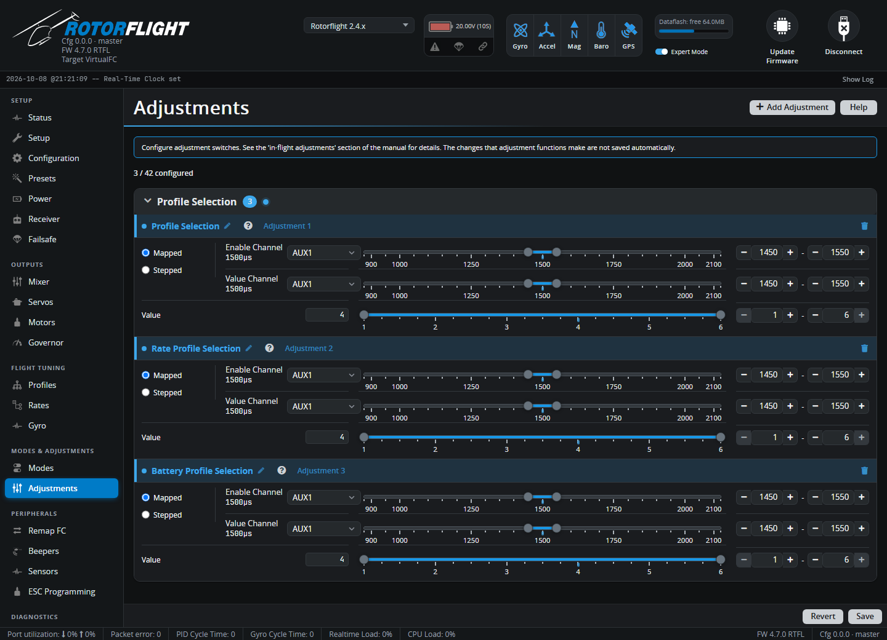

# Adjustments

Adjustments change settings in flight from a switch, knob or trim on your
radio: switch profiles, nudge a gain, set a headspeed. They're the way to
tune from the radio if you don't use the [Lua suites](../../radio/index.md).

Up to 42 adjustments can be set up. Changes are applied immediately, and
**saved when you disarm**. Each change gives a confirmation beep and is
recorded in the Blackbox log.

## Adding an adjustment

1. Click **Add Adjustment** and pick a function. Search, or browse the
   groups: Profile Selection, Rates, PID Gains, Filters, Yaw Dynamics,
   Stability, Accelerometer Trim, Setpoint Boost, Cross Coupling, Yaw
   Precomp, Rescue, Governor.
2. Set the **Enable Channel** and its range: the adjustment only works while
   this channel is in range. Use **ALWAYS** to leave it on all the time.
3. Choose the type and set the **Value Channel** (below).
4. Set the **Value** limits: the adjustment never goes outside them.
5. **Save**.

## Mapped and Stepped

=== "Mapped"

    The value channel's position sets the value directly: the range you set
    on the value channel is stretched over the value range. Use it with a
    knob or slider for gains, or with a multi-position switch for profiles.

    For example *Profile Selection*, value 1-3, on a 3-position switch:
    switch up = profile 1, middle = 2, down = 3.

    A small deadband stops the value flickering when a knob sits between two
    values.

=== "Stepped"

    The value channel works like a trim: moving it into the *decrease*
    range lowers the value by **Step**, moving it into the *increase* range
    raises it. Hold it there to repeat. Use it with a spring-loaded switch
    or a trim, for fine tuning a gain while flying.

## Functions

| Group | Functions |
| --- | --- |
| Profile Selection | PID profile, rate profile, battery profile, LED profile |
| Rates | Rate, expo and shape per axis |
| PID Gains | P, I, D, F per axis; B (boost) and O (HSI offset) gains |
| Filters | Gyro bandwidth and D-term cutoff per axis |
| Yaw Dynamics | Dynamic ceiling and deadband |
| Stability | Angle and Horizon levelling gains, Acro Trainer gain |
| Accelerometer Trim | Roll and pitch trim -- trim out a drifting hover in Angle mode |
| Setpoint Boost | Boost gain per axis |
| Cross Coupling | Gain, ratio and cutoff |
| Yaw Precomp | CW/CCW stop gains, cyclic and collective feedforward, inertia precomp, collective-to-pitch |
| Rescue | Climb and hover collective, hover altitude, altitude PID |
| Governor | Headspeed, gains, precomp, TTA, idle/auto/min/max throttle |

The `?` next to each function's name describes it.

See [Profile Switching](../../setup/profile-switching.md) for a worked
example.
