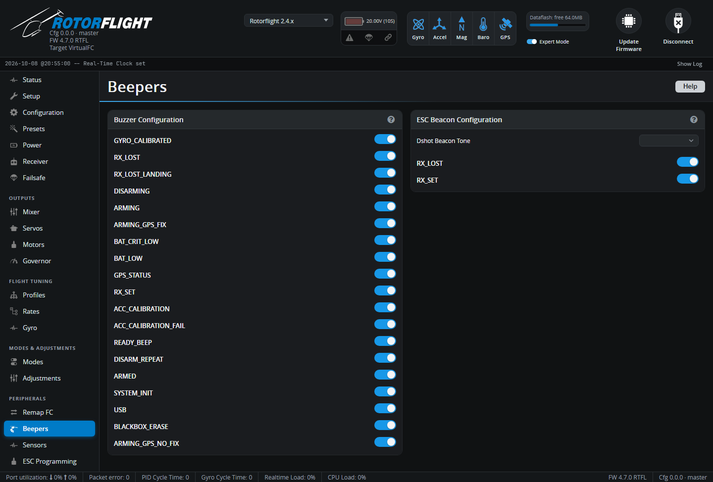

# Beepers

Choose when the buzzer sounds -- and, with DShot ESCs, when the motor
beeps.

## Buzzer Configuration

Tick the events that should sound the buzzer. The most useful ones on a
helicopter:

| Event | Sounds when |
| --- | --- |
| **GYRO_CALIBRATED** | Gyro calibration finished after power-up -- the helicopter is ready. |
| **RX_LOST** / **RX_LOST_LANDING** | The radio link is lost (failsafe). |
| **ARMING** / **DISARMING** / **ARMED** | Arming state changes, or while armed. |
| **BAT_LOW** / **BAT_CRIT_LOW** | Battery warning and critical levels (see [Power](power.md)). |
| **RX_SET** | The BEEPER mode switch is on -- for finding a helicopter after a crash. |
| **ACC_CALIBRATION** / **ACC_CALIBRATION_FAIL** | Accelerometer calibration. |
| **READY_BEEP** | Ready to arm. |
| **BLACKBOX_ERASE** | Blackbox flash erase finished. |
| **ON_USB** | Powered from USB -- usually untick this so the buzzer is quiet on the bench. |

GPS and camera events are for those devices.

## ESC Beacon Configuration

With DShot ESCs, the motor itself can beep (**Dshot Beacon**). Choose the
**Dshot Beacon Tone** and the events that trigger it -- typically *RX_LOST*
and *RX_SET*, to find a downed helicopter.

!!! warning
    The beacon drives current through the motor, which can make it warm. It
    can't sound while the motor is running, and arming is delayed by two
    seconds after the last beacon tone.

See [Buzzer](../../reference/buzzer.md) for the beep patterns.
