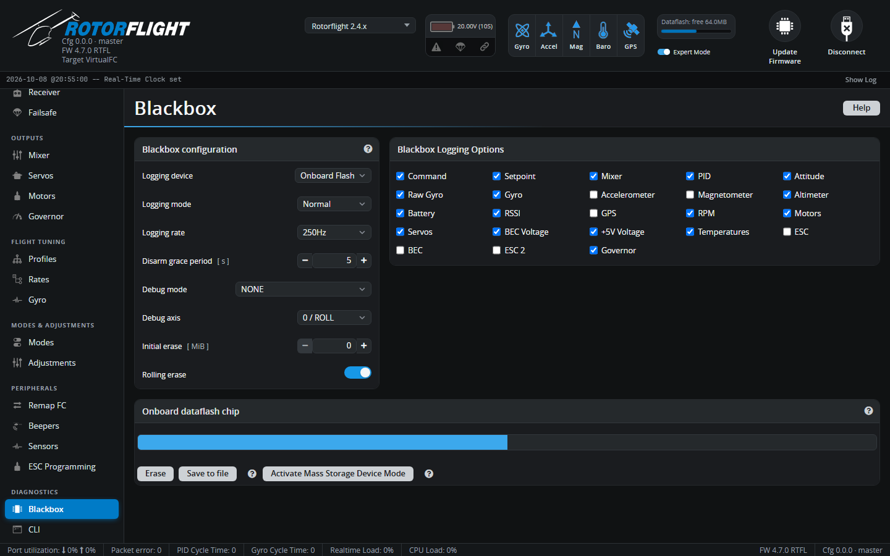

# Blackbox

The Blackbox records detailed flight data -- sticks, gyro, PID terms, servo
and motor outputs, RPM, governor, battery -- many times a second. Open the
logs in the [Blackbox Explorer](https://blackbox.rotorflight.org) to see
exactly what the helicopter did. It's the main tool for tuning and for
working out what went wrong.

## Blackbox configuration

| Setting | |
| --- | --- |
| **Logging device** | **Onboard Flash**, **SD Card** (if the board has one), **Serial Port** (an external logger such as [OpenLager](../../setup/openlager.md), on a UART set to *Blackbox Logging*), or **No Logging**. |
| **Logging mode** | **Armed** (default) -- log whenever armed. **Switch** -- log while the BLACKBOX mode switch is on. **Normal** -- log while armed *and* the switch is on. **Off**. |
| **Logging rate** | How often data is recorded. Higher rates show more detail but fill the flash faster. For filter and vibration work, log at the highest rate the device can manage; for general flying, lower is fine. External loggers may need a lower rate. |
| **Disarm grace period** [s] | Keeps logging for a few seconds after disarming, to capture what happened after a crash. 0 turns it off. |
| **Debug mode** / **Debug axis** | Adds eight extra values for troubleshooting a particular feature, e.g. `GOVERNOR`, `RPM_FILTER`, `RPM_SOURCE`, `TTA`, `AIRBORNE`. Leave on NONE unless you're investigating something. |
| **Initial erase** [MiB] | Erases old logs at arming so at least this much space is free. Logging starts once the erase finishes, which can take a while on some chips. 0 turns it off. |
| **Rolling erase** | When the flash is full, overwrite the oldest logs. On by default. |

## Blackbox Logging Options

Choose which data to record: Command, Setpoint, Mixer, PID, Attitude, Raw
Gyro, Gyro, Accelerometer, Magnetometer, Altimeter, Battery, RSSI, GPS, RPM,
Motors, Servos, BEC voltage, 5V voltage, Temperatures, ESC, BEC, ESC 2 and
Governor. Fewer fields mean more flight time fits on the flash.

## Onboard dataflash chip / SD card

Shows how full the storage is.

- **Activate Mass Storage Device Mode** -- the best way to get the logs:
  the flight controller reboots as a USB drive and you copy the files off.
  Eject and power cycle to return to normal.
- **Save to file** -- downloads the flash over the Configurator connection.
  Slow and can corrupt large logs; use mass storage mode instead.
- **Erase** -- deletes all logs.

See [Blackbox](../../reference/blackbox.md) in the Reference section for
more about logging.
