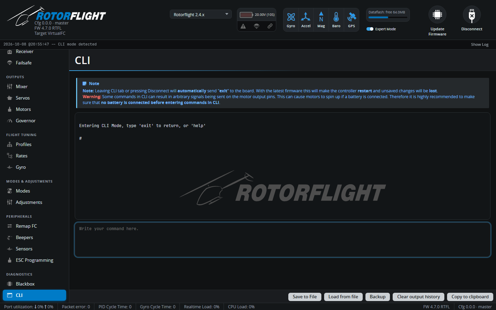

# CLI

The Command Line Interface gives direct access to every setting in the
flight controller, including ones the other tabs don't show.

Type a command in the box at the bottom and press Enter. Commands you'll
use most:

| Command | |
| --- | --- |
| `diff all` | Show everything that differs from the defaults -- the best backup. |
| `get <text>` | Show settings whose names contain the text, e.g. `get gov_`. |
| `set <name> = <value>` | Change a setting. |
| `save` | Save changes and reboot. **Nothing is kept until you `save`.** |
| `exit` | Leave the CLI without saving (the flight controller reboots). |
| `status` | System status, including the arming disable flags. |
| `help` | List all commands. |

The full list is in the [CLI Command Reference](../../reference/cli-reference.md).

## Buttons

| Button | |
| --- | --- |
| **Save to File** | Saves the output window to a text file. |
| **Load from file** | Loads a file of commands, shows them for review, then runs them on **Execute**. Used to [restore a backup](../../getting-started/backup-and-restore.md#restoring-a-backup). |
| **Backup** | Runs `diff all` or `dump all` and saves the result to a file in one step. |
| **Clear output history** | Clears the window. |
| **Copy to clipboard** | Copies the output. |

!!! warning
    Leaving the CLI tab, or disconnecting, sends `exit`: the flight
    controller reboots and unsaved changes are lost. Some commands can make
    the motor outputs move, so don't have a battery connected while you
    work in the CLI.
