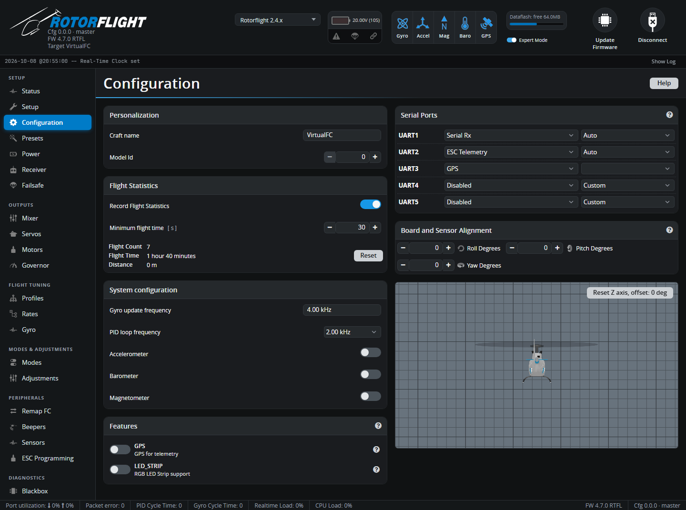

# Configuration

Board-level settings: names, statistics, loop speed, sensors, features,
serial port functions and board orientation. Most of these need a reboot,
so the tab saves with **Save and Reboot**.

## Personalization

- **Craft name** -- shown on the Status tab, saved in Blackbox logs and
  backups, and sent to the radio. Name each helicopter so you can tell
  backups apart.
- **Model Id** (0-99) -- a number sent to the radio as the *Model ID*
  telemetry sensor, so radio scripts can tell your helicopters apart.

## Flight Statistics

When **Record Flight Statistics** is on, the flight controller counts
flights, flight time and distance. A flight only counts if it stays armed
for at least the **Minimum flight time** (default 15 s), so bench tests
don't inflate the total. **Reset** clears the counters.

## System configuration

- **Gyro update frequency** -- how fast the gyro is read. Fixed by the
  board.
- **PID loop frequency** -- how often the flight controller runs its
  control loop, as a division of the gyro rate. 1-2 kHz is plenty for a
  helicopter; higher rates bring no benefit and load the CPU. Keep the
  *Realtime Load* in the status bar below 70%.
- **Accelerometer** -- needed by every self-levelling mode: Angle, Horizon,
  Acro Trainer and Rescue. Turn it off only if you use none of them.
- **Barometer** / **Magnetometer** -- if the board has them. They're used for
  telemetry only, not for flight control.

## Features

Optional features: **GPS** (for telemetry) and **LED_STRIP**. If a feature
switches itself off again after **Save and Reboot**, the board doesn't
support it.

Other features are turned on where they're configured -- for example the
governor on the [Governor](governor.md) tab and the RPM filter on the
[Gyro](gyro.md) tab.

## Serial Ports

Each UART can do one job. Pick its function on the left; where it matters,
pick the speed on the right. **Auto** uses the protocol's own speed.

| Function | Use it for |
| --- | --- |
| **Serial Rx** | Your receiver. Choose the protocol on the [Receiver](receiver.md) tab. |
| **ESC Telemetry** | Serial telemetry from the ESC. Choose the protocol on the [Motors](motors.md) tab; see [ESC Telemetry](../../setup/esc-telemetry.md). |
| **MSP** | A second Configurator or Lua connection, e.g. over Bluetooth. |
| **GPS** | A GPS module (enable the GPS feature too). |
| **Blackbox Logging** | An external logger such as [OpenLager](../../setup/openlager.md). |
| **S.BUS Output** | Drives SBUS servos, or other devices, from the flight controller. |
| **F.BUS** | FrSky F.Bus master: bus servos and sensors. See [FBUS Master](../../setup/fbus-master.md). |
| **S.PORT Master** | Reads FrSky S.Port sensors connected to the flight controller. |
| **SRXL2 ESC** | Spektrum SRXL2 ESCs. *New in 2.4.* |
| **CRSF Sensors** | CRSF sensors connected to the flight controller. See [CRSF Sensors](crsf-sensors.md). *New in 2.4.* |
| **Telemetry: FrSky SmartPort** | S.Port telemetry to an FrSky receiver, when the receiver itself uses another protocol (e.g. SBUS). |
| **Telemetry: FrSky Hub / iBUS / HoTT / MAVLink / LTM** | Telemetry for those systems. |

CRSF, ELRS, F.Port, F.Bus, SRXL2 and iBUS2 receivers carry telemetry over
the receiver link itself -- don't add a separate telemetry port for them.

On Rotorflight flight controllers the ports are labelled with the names
printed on the board (*Port A*, *S.BUS*, *DSM*...), with the UART number in
brackets.

## Board and Sensor Alignment

If the flight controller isn't mounted flat with its arrow pointing forward,
tell it how it's rotated: **Roll**, **Pitch** and **Yaw Degrees**. Common
cases:

| Mounting | Setting |
| --- | --- |
| Arrow pointing backwards | Yaw 180 |
| Arrow pointing right | Yaw 90 |
| Arrow pointing left | Yaw 270 |
| Upside down | Roll 180 |
| On its side, on the left of the frame | Roll 90 (or 270), plus yaw as needed |

Check the result on the 3D model: tilt the helicopter nose down, roll it
right and turn it right, and the model must do the same. **MAG Alignment**
appears when the board has a compass.

## Accelerometer Trim

Shown when the accelerometer is on. Fine-tunes the level that Angle,
Horizon and Rescue modes hold, to stop a hover drifting:

- **Roll trim** -- increase if the helicopter drifts left, decrease if it
  drifts right.
- **Pitch trim** -- increase if it drifts backwards, decrease if it drifts
  forwards.

Always leave your radio's cyclic trims at centre. You can also set these
trims in flight -- see [Stability Modes](../../setup/stability-modes.md).
