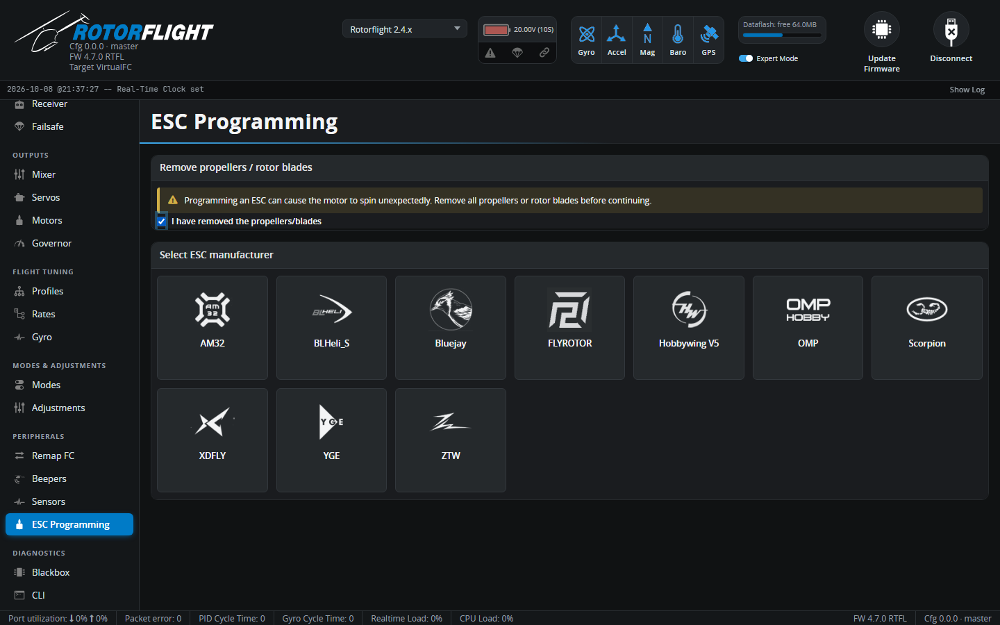

# ESC Programming

!!! info "New in 2.4"

Programs your ESC's settings through the flight controller -- no separate
programming card or ESC software. The same ESC settings are also available
from the radio in the [Lua suites](../../radio/index.md).

!!! danger "Remove the blades"
    Programming an ESC can start the motor unexpectedly. The tab won't go
    any further until you confirm the blades are off.

## Supported ESCs

| ESC | Connection |
| --- | --- |
| **Hobbywing V5**, **Scorpion**, **OMP**, **XDFLY**, **YGE**, **ZTW**, **FLYROTOR** | Over the ESC telemetry wire. Set the matching **Telemetry Protocol** on the [Motors](motors.md) tab; most need **Half-Duplex** on as well. The tab tells you which telemetry protocol each one needs. |
| **AM32**, **BLHeli_S**, **Bluejay** | Over the throttle signal wire, using a pass-through to the ESC's bootloader. For DShot ESCs. |

See [ESC Forward Programming](../../setup/esc-programming.md) for wiring
and set-up per ESC.

## Using it

1. Remove the blades and tick the confirmation.
2. Pick your ESC manufacturer. With a motorised tail, choose **ESC 1 (Main
   / Motor)** or **ESC 2 (Tail)**.
3. The Configurator connects to the ESC and reads its settings. Some ESCs
   only enter programming mode at power-up -- if asked, unplug and
   reconnect the ESC's battery.
4. Change the settings and save. ESCs without a live link need a power
   cycle afterwards for the changes to take effect; the tab tells you when.

**Change ESC** goes back to the manufacturer list. Programming is blocked
while the flight controller is armed.
