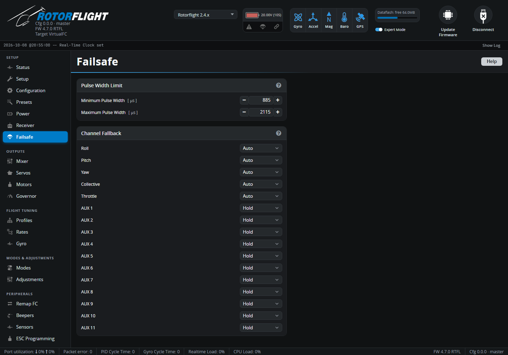

# Failsafe

What the flight controller does when the radio link is lost.

## How failsafe works

1. **Short dropouts** -- for a fraction of a second, the last good values are
   held and you won't notice.
2. **Stage 1** -- if the signal is still missing, each channel switches to
   its **Channel Fallback** value (below) for up to 1.5 s
   (`failsafe_delay`). If the link comes back in this time, you have control
   again straight away.
3. **Stage 2** -- if the link is still lost, the flight controller
   **disarms**: the motor stops. After the link returns, it needs a second
   of good signal and the arm switch toggled before it will arm again.

The `FAILSAFE` mode on the [Modes](modes.md) tab triggers the same thing
from a switch.

!!! warning "Set up your receiver's own failsafe"
    The receiver must stop sending channel data when it loses the link (on
    many receivers this is called *No Pulses*). If it's set to hold the
    last values or send preset positions instead, the flight controller
    can't tell the link is gone. Most serial receivers -- CRSF, F.Bus,
    SBUS -- signal failsafe properly by default.

**Test it** with the blades off: arm, spool up a little, switch the radio
off, and check the motor stops within a couple of seconds.

## Pulse Width Limit

Channel values outside **Minimum Pulse Width** (default 885 µs) to
**Maximum Pulse Width** (2115 µs) are treated as invalid, and trigger
failsafe for that channel.

## Channel Fallback

What each channel does during stage 1:

| Option | |
| --- | --- |
| **Auto** | A safe value: cyclic, yaw and collective centred, throttle low. *(Roll, Pitch, Yaw, Collective and Throttle only.)* |
| **Hold** | Keep the last good value. Default for the AUX channels, so switches -- including the arm switch -- don't change during a short dropout. |
| **Set** | Use the value you enter, in µs. |

Leave the main controls on **Auto** unless you have a specific reason.
