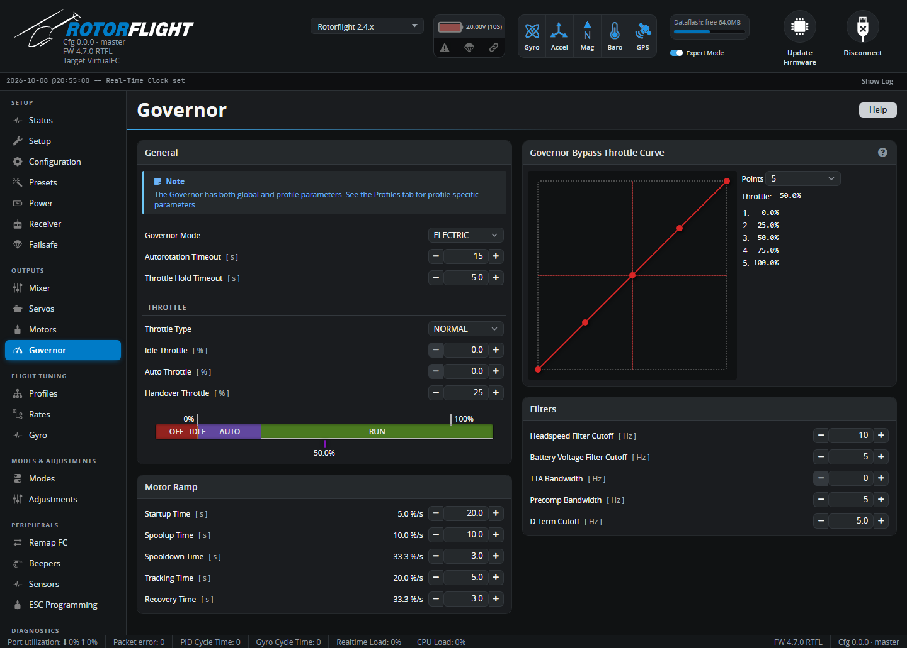

# Governor

Global governor settings: the governor mode, how the throttle channel
works, ramp speeds, filters and the bypass throttle curve. The target
headspeed and the governor gains are per profile, on the
[Profiles](profiles.md#governor-settings) tab.

!!! tip "Start here"
    New to the Rotorflight governor? Read [Governor](../../setup/governor.md)
    first -- it explains the modes, throttle types and states -- then
    [Governor Setup](../../setup/governor-setup.md) for a walk-through.

## General

**Governor Mode**

| Mode | What it does | Needs RPM? |
| --- | --- | :-: |
| **OFF** | No governor. Throttle input goes straight to the ESC. | No |
| **LIMIT** | No governor, but the idle, minimum and maximum throttle limits are applied. | No |
| **DIRECT** | Slow spoolup, throttle hold recovery and autorotation bailout, but no headspeed control. For an ESC with its own governor, or a throttle curve in the radio. | No |
| **ELECTRIC** | Full governor, tuned for electric motors. | Yes |
| **NITRO** | Full governor, tuned for nitro and petrol engines. | Yes |

| Setting | Meaning |
| --- | --- |
| **Autorotation Timeout** [s] | How long an autorotation may last and still be bailed out of. **0 disables autorotation bailout.** |
| **Throttle Hold Timeout** [s] | After throttle hold is switched on in flight, the time during which switching it off again gives a fast recovery instead of a slow spoolup -- protection against hitting hold by accident. |

## Throttle

| Setting | Meaning |
| --- | --- |
| **Throttle Type** | How the throttle channel is used. **NORMAL**: throttle drives the motor until the target headspeed is reached, then the governor takes over (throttle on a switch or a stick curve). **SWITCH**: below handover the throttle drives the motor directly; above it, the throttle position sets the target headspeed (switch only; ELECTRIC and NITRO). **FUNCTION**: the throttle position selects OFF / IDLE / AUTO / RUN -- ideal for ELRS low-resolution switch channels. |
| **Idle Throttle** [%] | The lowest throttle output while the governor isn't controlling headspeed -- the idle level, kept in the flight controller rather than the radio. |
| **Auto Throttle** [%] | NORMAL/SWITCH: throttle input below this cancels autorotation (so no bailout). FUNCTION: the output throttle in AUTO. |
| **Handover Throttle** [%] | Above this throttle input the governor takes over; below it the throttle goes straight to the motor. The motor must start below this level, and a nitro clutch must engage below it. |

The bar under the settings shows how the throttle range is divided between
OFF, IDLE, AUTO and RUN, with the live throttle position.

## Motor Ramp

Ramp rates are the time for a 0-100% throttle change -- longer is gentler.

| Setting | When it applies |
| --- | --- |
| **Startup Time** [s] | Throttle changes below handover (idle), e.g. starting the motor. |
| **Spoolup Time** [s] | Spooling up from idle to the target headspeed. Long enough to be gentle on the drivetrain -- 10 s or so. |
| **Spooldown Time** [s] | Throttle reductions at idle. |
| **Tracking Time** [s] | Changes of target headspeed while flying, e.g. switching profile. |
| **Recovery Time** [s] | Fast spoolups when already flying: recovery after throttle hold or fallback, and autorotation bailout. |

## Governor Bypass Throttle Curve

When the **GOVERNOR BYPASS** mode is switched on (see [Modes](modes.md)),
all governor functions -- including ramps and safeguards -- are off, and
the throttle comes from this collective-to-throttle curve instead. Set the
number of **Points** and drag them to shape the curve. Use it as a backup
for a failed RPM signal, or to fly a traditional throttle curve.

## Filters

| Setting | Filters |
| --- | --- |
| **Headspeed Filter Cutoff** [Hz] | The measured headspeed. |
| **Battery Voltage Filter Cutoff** [Hz] | Battery voltage, for voltage compensation. |
| **TTA Bandwidth** [Hz] | Tail Torque Assist. |
| **Precomp Bandwidth** [Hz] | The cyclic/collective/yaw precompensation. |
| **D-Term Cutoff** [Hz] | The governor's D-term. |

The defaults suit most helicopters.
