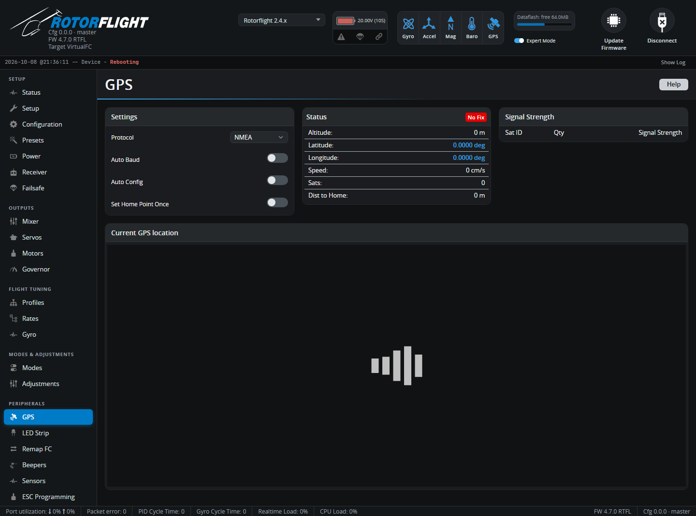

# GPS

Settings and live status for a GPS module. In Rotorflight, GPS is used for
telemetry -- position, speed, altitude and distance on your radio -- and for
flight statistics.

The tab appears once the **GPS** feature is on and a UART is set to **GPS**
on the [Configuration](configuration.md) tab.

## Settings

| Setting | |
| --- | --- |
| **Protocol** | **UBLOX** for u-blox modules (most GPS modules), or **NMEA**. |
| **Ground Assistance Type** | SBAS correction: **Auto-detect**, or pick your region (EGNOS, WAAS, MSAS, GAGAN), or **None**. |
| **Auto Baud** | Finds the module's baud rate automatically. |
| **Auto Config** | Configures a u-blox module for the flight controller at power-up. Leave it on. |
| **Use Galileo** | Use the European Galileo satellites (instead of the Japanese QZSS). |
| **Set Home Point Once** | Use the first arming after power-up as home; otherwise home is reset on every arming. |

## Status

Fix, number of satellites, position, altitude, speed and distance from home,
with the signal strength of each satellite and the position on a map (the
map needs an internet connection).
