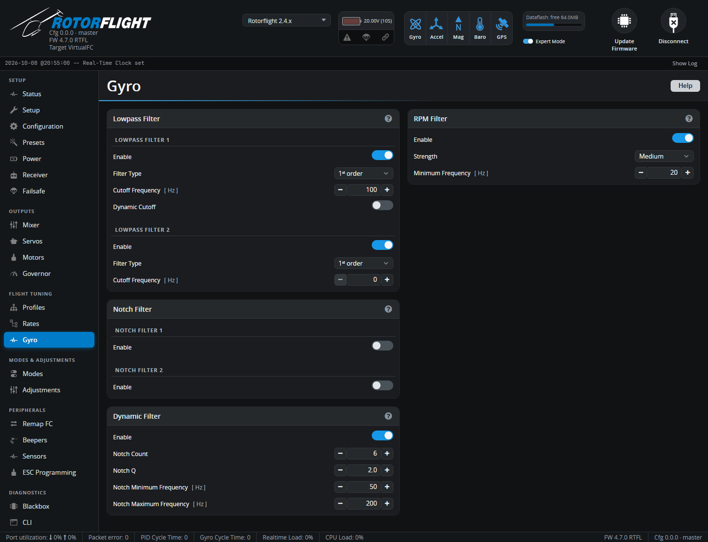

# Gyro

Gyro filtering. Every spinning part of a helicopter -- motor, main rotor,
tail rotor, gears, fans -- shakes the flight controller. The filters on
this tab remove that vibration from the gyro signal, so the PID controller
only reacts to how the helicopter is really moving.

Every filter adds some delay, and delay hurts the tune. The goal is just
enough filtering to keep the servos quiet and cool -- no more.

!!! tip "The usual setup"
    - With an RPM signal: **RPM Filter** on (Medium), one lowpass around
      100 Hz, dynamic filter with 2-4 notches.
    - Without an RPM signal: two second-order lowpass filters, dynamic
      filter with 4-6 notches.

    Check the result with a [Blackbox](blackbox.md) log; see
    [Filter Tuning](../../tuning/filters.md).

## RPM Filter

Uses the motor RPM and the gear ratios to know exactly where the rotor,
tail and motor vibrations are, and puts narrow notch filters on them. It
removes vibration with far less delay than general-purpose filters, so it's
the most effective filter you can use.

| Setting | |
| --- | --- |
| **Enable** | Needs a real-time RPM source: the RPM sensor input or bidirectional DShot. ESC serial telemetry is too slow. Gear ratios and pole count must be right on the [Motors](motors.md) tab. |
| **Strength** | **Low**, **Medium** or **High**: more notches remove more vibration but add delay. Medium suits most helicopters. **Custom** appears when the notches have been set by hand. |
| **Minimum Frequency** [Hz] | Notches stop following the RPM below this. Set it a little below the main rotor frequency at your lowest flying headspeed (headspeed ÷ 60). |

With **Custom**, the tab lists each notch -- main rotor harmonics 1-8,
tail rotor, main and tail motor -- with its Q (width) and type. See
[RPM Filters](../../setup/rpm-filters.md).

If RPM filtering is on but an RPM signal is missing, the flight controller
won't arm (`RPMFILTER` flag).

## Lowpass Filter

Two lowpass filters cut everything above a cutoff frequency.

| Setting | |
| --- | --- |
| **Enable** | Turns each filter on. |
| **Filter Type** | 1st order (less delay) or 2nd order (stronger). |
| **Cutoff Frequency** [Hz] | Vibration above this is reduced. |
| **Dynamic Cutoff** (filter 1) | Moves the cutoff with the headspeed, between **Min** and **Max Cutoff Frequency**. |

With the RPM or dynamic filters running, one filter around 100 Hz is
enough. Without them, use both, second order.

## Notch Filter

Two fixed notch filters for resonances that don't move with RPM, such as a
frame or boom resonance found in a Blackbox log. Each has a **Center
Frequency** and a **Cutoff Frequency** where the notch starts: cutoff 160 and
centre 260 filter 160-360 Hz, most strongly around 260 Hz. Leave them off
unless you've found a resonance to remove.

## Dynamic Filter

Finds the strongest vibration peaks in the gyro signal and places notches
on them automatically.

| Setting | |
| --- | --- |
| **Notch Count** | How many peaks to track. 4-6 on its own, 2-4 alongside the RPM filter. |
| **Notch Q** | Notch width: higher is narrower. 2.0-4.0; below 2.0 adds a lot of delay. |
| **Notch Minimum Frequency** [Hz] | Lowest frequency to track: below the main rotor frequency, but not under 20 Hz. |
| **Notch Maximum Frequency** [Hz] | Highest frequency to track: 10-20% above the tail rotor frequency, and no more than 250 Hz with a 1 kHz filter rate. With 2 kHz or more, 330-500 Hz suits small helicopters with motorised tails. |
