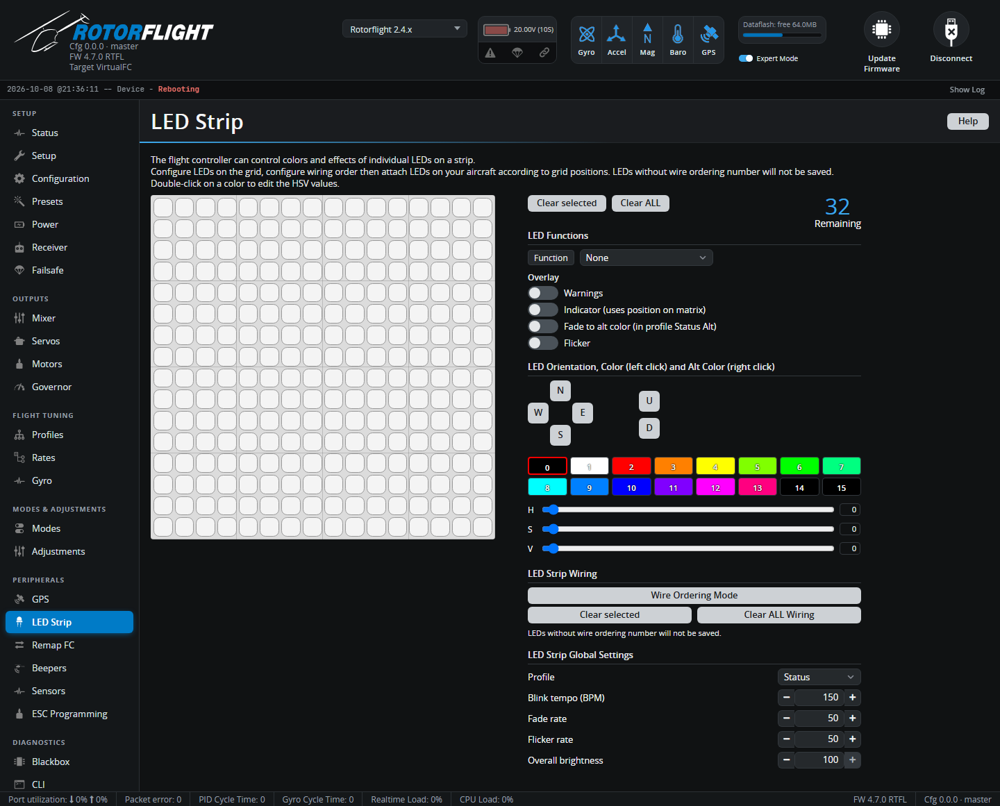

# LED Strip

Sets up addressable LED strips (WS2811/WS2812) -- for orientation lights,
battery and arming status, or just show. The tab appears when the
**LED_STRIP** feature is on, on the [Configuration](configuration.md) tab.

!!! tip "Step-by-step"
    For a walk-through -- wiring, laying out the grid and choosing colours --
    see [LED Strip](../../setup/led-strip.md) in the Setup Guides.

## How it works

The grid is a map of your helicopter: each square is a possible LED
position. You place LEDs on the grid, number them in the order they're
wired, and give each one a function and colour.

1. Select squares on the grid.
2. Pick a **Function** for them, and options such as orientation (N, E, S, W,
   Up, Down) and **Color modifiers**.
3. Pick a colour from the palette (double-click a colour to edit its hue,
   saturation and value).
4. Use the **Wiring** mode to number the LEDs in the order they're
   connected. LEDs without a wiring number aren't saved.

**Clear selected** and **Clear ALL** start over. *Remaining* shows how many
more LEDs you can add.

## Functions and overlays

| Function | |
| --- | --- |
| **Color** | A fixed colour. |
| **Modes & Orientation** | Colour depends on the flight mode and the LED's direction. |
| **Arm state** | Shows armed / disarmed. |
| **Battery** | Colour shows the battery level. |
| **RSSI** | Colour shows link quality. |
| **GPS** | Shows the GPS state. |
| **Ring** / **Larson scanner** | Animated effects. |

**Overlays** add effects on top: *Warnings* (flashes on warnings such as low
battery), *Indicator*, *Blink*, *Fade to alt color*, *Flicker*.

## LED Strip Global Settings

| Setting | |
| --- | --- |
| **Profile** | **Status** (normal), **Status Alt** (with alternate colours), **Beacon**, or **Race**. Can be switched from the radio with an [adjustment](adjustments.md). |
| **Blink tempo** / **Fade rate** / **Flicker rate** | Speed of the effects. |
| **Overall brightness** | Dims all LEDs. The LEDLOW [mode](modes.md) also dims them from a switch. |

**Mode colors** and **Special colors** set the colours used by the modes and
orientation function, and by special states such as disarmed, armed and
blink background.

See [LED Strip](../../reference/led-strip.md) in the Reference section for
the CLI commands behind this tab.
