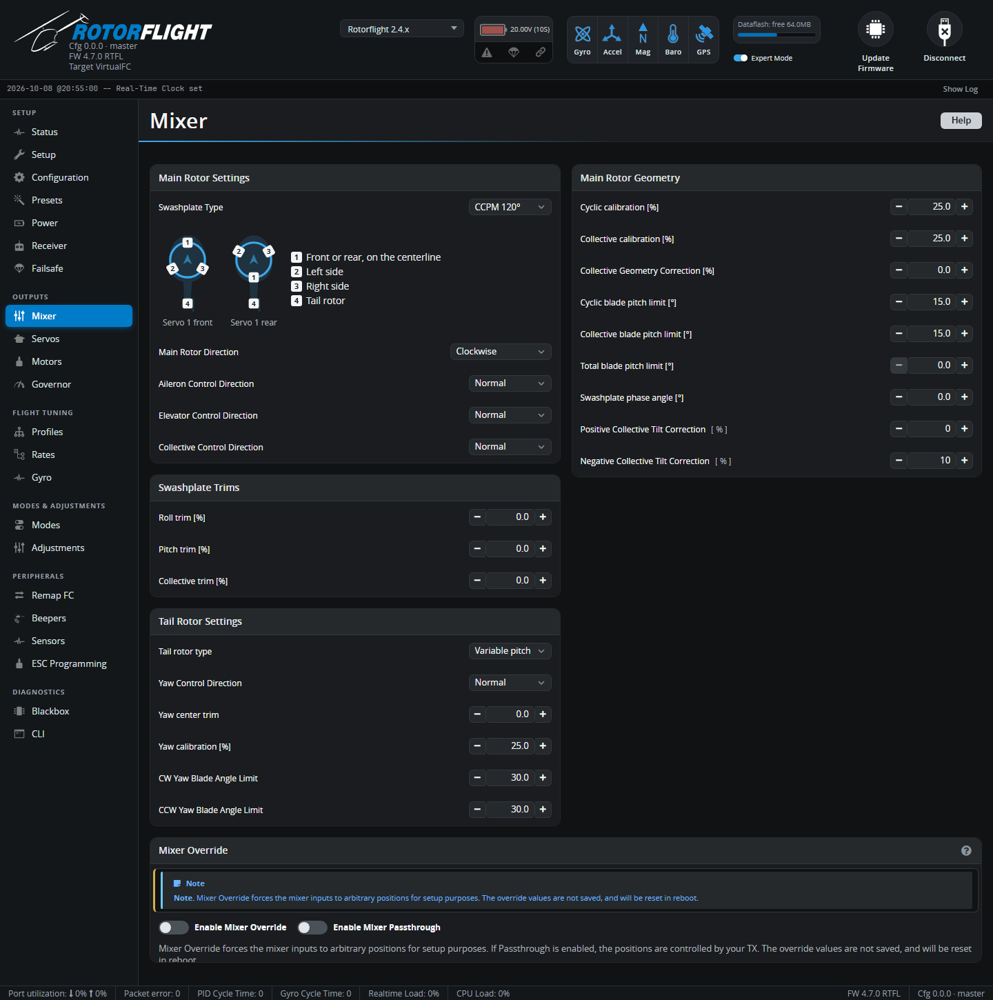

# Mixer

The mixer turns the flight controller's roll, pitch, collective and yaw
commands into servo and tail motor positions. This tab sets the swashplate
type, control directions, the calibration that makes commanded blade angles
match real ones, and the mechanical limits.

!!! tip "Step-by-step"
    This page explains each setting. For the full procedure, in order, see
    [Mixer & Swashplate Setup](../../setup/mixer.md). Set up the
    [servos](../../setup/servos.md) first.

Blade angles in this tab are in **degrees**. Rotorflight works in real blade
pitch throughout, which is why the calibration matters: the default PIDs and
rates assume that "10°" really means 10° at the blades.

## Main Rotor Settings

**Swashplate Type**

| Type | For |
| --- | --- |
| **CCPM 120°** | Three servos 120° apart -- most helicopters. |
| **CCPM 135°** / **CCPM 140°** | Three servos with the side servos at 135° or 140°. |
| **FPM 90° L** / **FPM 90° V** | Fixed-pitch helicopters with two swashplate servos at 90°. |
| **Direct** | No mixing: roll, pitch and collective go straight to servos 1-3, for an external mixer. |
| **None** | Mixer off. Mixing rules must be set up in the CLI with the `mixer` command. |

The diagram next to the selector shows which servo output goes where. For
CCPM, **servo 1** is on the centreline, front or rear; **servo 2** on the
left; **servo 3** on the right; **servo 4** is the tail.

**Main Rotor Direction** -- looking down from above. Most helicopters turn
clockwise.

**Aileron / Elevator / Collective Control Direction** -- reverse an axis if
the swashplate moves the wrong way for that stick. Check with the
[Mixer Override](#mixer-override) or your radio:

| Input | Swashplate must |
| --- | --- |
| Roll right | Tilt right |
| Pitch forward | Tilt forward |
| Collective up | Rise, increasing blade pitch |

Trailing-edge control heads often need **Collective** reversed.

## Swashplate Trims

**Roll**, **Pitch** and **Collective trim** [%] level the swashplate and zero
the blade pitch electronically. Use them only if the linkages can't be
adjusted -- adjusting linkages keeps the full servo travel available.

## Main Rotor Geometry

| Setting | What it does |
| --- | --- |
| **Cyclic calibration** [%] | Scales cyclic so that a commanded cyclic angle gives the same blade angle. |
| **Collective calibration** [%] | Scales collective the same way. |
| **Collective Geometry Correction** [%] | Evens out the difference between positive and negative collective that the head geometry causes. Adjust until +10° and -10° commanded measure the same. |
| **Cyclic blade pitch limit** [°] | The most cyclic the head can physically do. **Not** a rate setting -- it's the mechanical limit, so the flight controller never asks for more. Typically 12-16°. |
| **Collective blade pitch limit** [°] | The most collective the head can do. Set it to the mechanical maximum you'd ever use (often 14-16°); the collective you actually fly is set on the [Rates](rates.md) tab. |
| **Total blade pitch limit** [°] | The most cyclic + collective combined, before servos or links run out of travel at the extremes. |
| **Swashplate phase angle** [°] | Rotates the cyclic controls, for heads that need phasing. Leave at 0 unless the manufacturer says otherwise. |
| **Positive / Negative Collective Tilt Correction** [%] | Corrects the swashplate tilting with collective at the extremes. At full positive (then full negative) collective, adjust until the swashplate ball stays put when you add cyclic. |

## Tail Rotor Settings

**Tail rotor type**

| Type | |
| --- | --- |
| **Variable pitch** | Servo-driven tail pitch, on servo 4. |
| **Motorised** | A separate tail motor on motor output 2. |
| **Bidirectional** | A motorised tail that can reverse. Experimental; needs extra CLI settings. |

For a **variable pitch** tail:

| Setting | |
| --- | --- |
| **Yaw Control Direction** | Reverse if the tail pushes the nose the wrong way: rudder right must yaw the nose right. |
| **Yaw center trim** | Trims the tail to zero blade pitch with 0° yaw commanded. |
| **Yaw calibration** [%] | Scales yaw so commanded tail angle matches real tail blade angle. Usually 50-150%. |
| **CW / CCW Yaw Blade Angle Limit** [°] | The most tail pitch in each direction before anything binds. |

For a **motorised** tail:

| Setting | |
| --- | --- |
| **Yaw center offset** [%] | Tail motor throttle for zero yaw command. |
| **Yaw calibration** [%] | Leave at 100% for a motorised tail. |
| **CW / CCW yaw limit** [%] | Limits on tail motor output. |
| **Motor idle throttle** [%] | The least throttle sent to the tail motor, just enough to keep it turning. |

See [Motorised Tail & TTA](../../tuning/motorised-tail.md).

## Mixer Override

**Enable Mixer Override** lets you command exact roll, pitch, collective and
yaw angles from the Configurator, for calibration. **Enable Mixer
Passthrough** drives them from your radio sticks instead. Overrides aren't
saved, are cleared on reboot, and block arming (`OVERRIDE` flag) while on.

!!! warning
    Override moves the servos -- keep fingers clear of the head. The motor
    is not affected.

## Custom mixers

If the mixer was set up with custom rules in the CLI, the tab shows a
warning and the related settings can only be changed in the CLI, with the
`mixer` and `mixer rule` commands.
