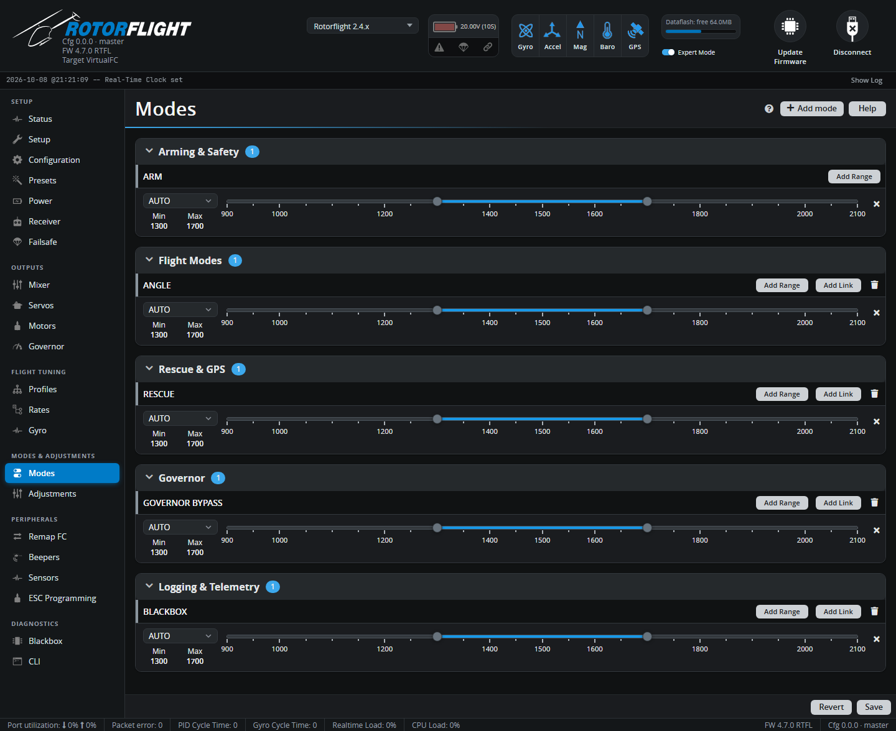

# Modes

Modes are switched on and off from your radio: arming, self-levelling,
rescue, Blackbox logging and so on. Each mode gets one or more **ranges** on
an AUX channel; when the channel is inside a range, the mode is on.

## Adding a mode

1. Click **Add mode** and pick the mode. Modes are grouped -- Arming &
   Safety, Flight Modes, Rescue & GPS, Governor, Logging & Telemetry.
2. Pick the AUX channel, or leave it on **AUTO** and flip the switch you
   want to use: AUTO picks the first channel that moves.
3. Drag the range so it covers the switch position that should turn the
   mode on. The marker on the slider shows the live channel value.
4. **Save**.

A mode can have several ranges. With **OR** the mode is on if *any* range is
active; with **AND** only when *all* are. **Add Link** turns a mode on
whenever another mode is on (ARM can't be linked). A mode that is currently
active is highlighted, as is its group.

## The modes

| Mode | What it does |
| --- | --- |
| **ARM** | Arms the flight controller. Required. See [Arming & Safety](../../getting-started/arming.md). |
| **PREARM** | A second switch that must be on before ARM works. |
| **ANGLE** | Self-levelling: the stick sets a tilt angle, and the helicopter levels when you let go. Needs the accelerometer. |
| **HORIZON** | Self-levelling near centre stick, normal flight at full stick. |
| **TRAINER** | Acro Trainer: normal flight, but tilt is limited to a set angle. |
| **RESCUE** | Levels the helicopter, flips it upright if needed, climbs and hovers. Must be enabled in the [profile](profiles.md#rescue-settings). |
| **GOVERNOR BYPASS** | Turns all governor functions off and uses the bypass throttle curve on the [Governor](governor.md) tab. |
| **GOVERNOR FALLBACK** | Simulates a lost RPM signal, to test the governor's fallback. |
| **GOVERNOR SUSPEND** | Suspends the governor's PID, leaving only feedforward. |
| **FAILSAFE** | Triggers failsafe -- for testing. See [Failsafe](failsafe.md). |
| **BLACKBOX** | Logs to Blackbox only while on (with Blackbox mode set to *Switch*). |
| **BLACKBOX ERASE** | Erases the Blackbox flash. Only while disarmed. |
| **BEEPER** | Sounds the buzzer -- for finding a helicopter in long grass. |
| **BEEPER MUTE** | Silences the buzzer. |
| **LEDLOW** | Dims the LED strip. |
| **PARALYZE** | Disables the flight controller until it's power cycled. |
| **GPS RESCUE**, **GPS BEEP SATELLITE COUNT** | GPS functions (with the GPS feature on). |
| **TELEMETRY** | Turns telemetry on while active. |
| **CAMERA CONTROL 1-3**, **VTX PIT MODE**, **OSD DISABLE**, **USER1-4** | For cameras, video transmitters and custom pin outputs. |

Which modes appear depends on the features and sensors you have -- the
self-levelling modes need the accelerometer, GPS modes need GPS, and so on.

!!! tip "Use one switch for several things"
    A 3-position switch on one AUX channel can do more than one job: for
    example *low* = normal flight, *middle* = ANGLE, *high* = RESCUE, by
    giving each mode a different range.
