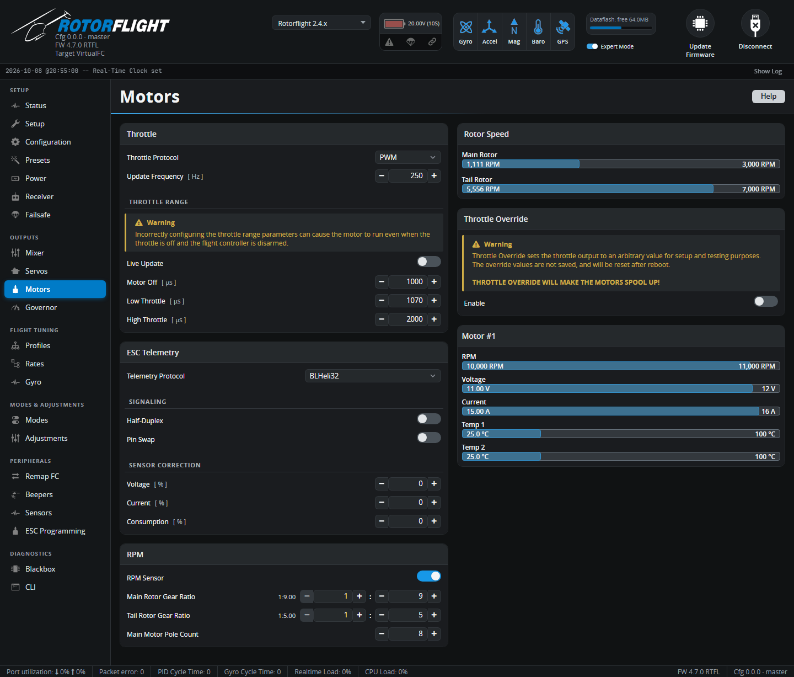

# Motors

ESC protocol, throttle range, ESC telemetry, RPM measurement and motor
testing.

!!! danger "Blades off"
    Throttle Override, and some throttle range settings, can start the
    motor. Remove the blades before working on this tab with a battery
    connected.

## Throttle

**Throttle Protocol** -- how the flight controller talks to the ESC:

| Protocol | For |
| --- | --- |
| **PWM** | Almost all helicopter ESCs. |
| **DSHOT150 / 300 / 600** | Multirotor-style ESCs (BLHeli_S/Bluejay, AM32, BLHeli32). Allows bidirectional DShot RPM. |
| **ONESHOT125 / ONESHOT42 / MULTISHOT / PROSHOT1000** | Faster analogue protocols for multirotor ESCs. |
| **CASTLE** | Castle Creations ESCs with Live Link telemetry on the throttle wire. See [ESC Telemetry](../../setup/esc-telemetry.md). |
| **SRXL2** | Spektrum SRXL2 ESCs: throttle and telemetry on one wire. *New in 2.4.* |
| **DISABLED** | No motor output. |

**Update Frequency** [Hz] (PWM only) -- how often the throttle pulse is
sent. 50-250 Hz; most modern ESCs are happy at 250.

### Throttle Range

The pulse widths sent to the ESC, for PWM-type protocols:

| Setting | Default | Meaning |
| --- | --- | --- |
| **Motor Off** [µs] | 1000 | Sent while disarmed or in throttle hold. The ESC must see this as "stop" so it arms. |
| **Low Throttle** [µs] | 1070 | Sent at the lowest running throttle (idle, for a nitro engine). |
| **High Throttle** [µs] | 2000 | Sent at full throttle. |

Most helicopter ESCs need their throttle range calibrated to match --
follow the ESC's instructions, using Throttle Override at 0% and 100%.
**Live Update** applies changes immediately, so that overriding to 0%, 1%
and 100% shows Motor Off, Low and High.

!!! warning
    If **Motor Off** is set higher than the ESC's stop point, the motor can
    run while the flight controller is disarmed.

## ESC Telemetry

**Telemetry Protocol** -- the ESC's serial telemetry, on the UART set to
*ESC Telemetry* on the [Configuration](configuration.md) tab: BLHeli32,
Hobbywing V4, Hobbywing V5, Scorpion, Kontronik, OMPHobby, ZTW, APD,
OpenYGE, FlyRotor, Graupner, XDFly, FBUS, SRXL2, or Record (for logging raw
data). See [ESC Telemetry](../../setup/esc-telemetry.md).

- **Half-Duplex** -- send and receive on one wire; needed for
  [forward programming](../../setup/esc-programming.md) of ESCs such as
  Hobbywing V5 and Scorpion.
- **Pin Swap** -- swaps RX and TX (not on F4).
- **Sensor Correction** [%] -- scales the ESC's reported **Voltage**,
  **Current** and **Consumption** to match reality.

## RPM

The flight controller needs the motor RPM for the governor and the RPM
filters. See [RPM Measurement](../../setup/rpm-measurement.md).

| Setting | |
| --- | --- |
| **RPM Sensor** | Read RPM from the flight controller's frequency input, wired to the ESC's RPM output or an RPM sensor. |
| **Dshot RPM Telemetry** | Read RPM back over bidirectional DShot (AM32, Bluejay, BLHeli32 32.7+). |
| **Main Rotor Gear Ratio** | Motor pinion : main gear teeth, e.g. `12 : 120`. For a two-stage gearbox see [Gear Ratios](../../setup/gear-ratios.md). |
| **Tail Rotor Gear Ratio** | Tail rotor : main rotor. Tail gear : autorotation gear teeth for a torque tube, tail pulley : front pulley for a belt, 1 : 1 for direct drive. |
| **Main Motor Pole Count** | Number of **magnets** in the motor bell (not the stator teeth). From the motor data sheet, or count them. 0 disables RPM. |

**Rotor Speed** shows the calculated main and tail rotor RPM. Spin the rotor
by hand with RPM coming in, or use a tachometer during a test, to check the
gear ratio and pole count are right.

## Throttle Override

Sets the throttle output directly, for testing the ESC and RPM without a
radio. It switches itself off if the Configurator stops sending it, and
blocks arming while on. **This spins the motor.**

## Motor #1 (and #2)

Live data per motor from ESC telemetry and RPM: RPM, voltage, current,
temperatures, and the DShot RPM error rate. A second motor appears with a
motorised tail.
