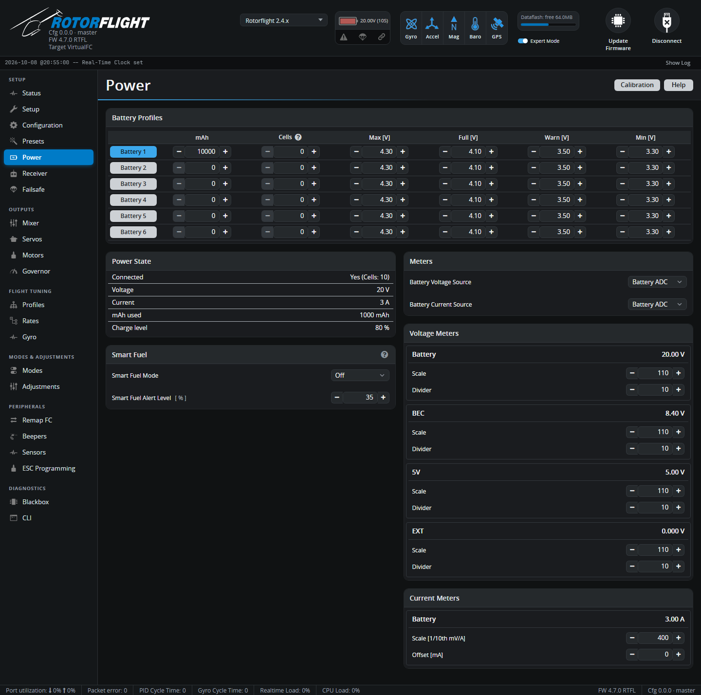

# Power

Battery measurement, battery profiles, SmartFuel and voltage/current sensor
calibration.

## Battery Profiles

Rotorflight keeps **six battery profiles**, so one helicopter can fly
different packs -- for example 6S and 12S, or LiPo and LiHV -- with the right
alarms and fuel gauge for each. Each row holds:

| Column | Meaning | Typical LiPo |
| --- | --- | --- |
| **mAh** | Pack capacity. Used for mAh-based fuel and SmartFuel *Current* mode. | Your pack |
| **Cells** | Number of cells. **0** detects the count from the voltage when the battery is plugged in -- reliable for full packs, but a half-empty pack can be miscounted, so set it if you can. | 0 or your pack |
| **Max [V]** | Highest believable cell voltage; used for cell count detection. | 4.30 |
| **Full [V]** | A fully charged cell. The fuel gauge reads 100% here. | 4.10-4.20 |
| **Warn [V]** | Low-voltage warning. | 3.50 |
| **Min [V]** | Empty cell. The fuel gauge reads 0% here. | 3.30 |

For LiHV packs raise **Max** and **Full** (e.g. 4.40 and 4.35).

Click a **Battery** button to make that profile active. You can also switch
from the radio with the *Battery Profile* [adjustment](adjustments.md) or
the Lua suite. A change made while armed is applied once you disarm.

## Power State

Live readings: whether a battery is detected (and its cell count), voltage,
current, mAh used and charge level. With USB power only, *Connected* reads
No.

## Smart Fuel

SmartFuel gives a fuel percentage that behaves sensibly in flight: it never
jumps back up when the load drops, and it allows for voltage sag under load.

| Setting | |
| --- | --- |
| **Smart Fuel Mode** | **Off**; **Voltage** -- estimate from the pack voltage; **Current** -- mAh used against the profile's capacity; **Combined** -- whichever of the two is lower. A battery voltage source is needed for any mode. |
| **Smart Fuel Alert Level** [%] | The landing reserve. The radio scripts show 0% fuel at this level. Default 35%. |
| **Voltage Drop Rate** | *(Voltage and Combined)* How fast the voltage estimate may fall. |
| **Charge Drop Rate** | *(Voltage and Combined)* How fast the displayed percentage may fall once armed. |
| **Sag Gain** | *(Voltage and Combined)* Expected sag per cell at full load. Raise it if SmartFuel reads too low under load, lower it if it reads too high. |

See [SmartFuel](../../setup/smartfuel.md) for how it works and how to set
it up.

## Meters

Where the battery voltage and current come from:

| Source | |
| --- | --- |
| **None** | Not measured. |
| **Battery ADC** | The flight controller's own voltage and current inputs. |
| **ESC** | The ESC's telemetry. See [ESC Telemetry](../../setup/esc-telemetry.md). |
| **FBUS** | FrSky voltage/current sensors on the F.Bus or S.Port master link. |
| **CRSF** | CRSF sensors connected to the flight controller. |

## Voltage Meters and Current Meters

Each ADC input -- Battery, BEC, 5V, EXT -- has a **Scale** and **Divider**,
and the current meter a **Scale** and **Offset**. Rotorflight flight
controllers come with these set correctly. For other boards, use the
**Calibration** button:

1. Remove the blades and plug in a battery.
2. Measure the real battery voltage with a multimeter (and the current, if
   you have a way to).
3. Click **Calibration**, enter the measured values and click **Calibrate**.
4. Check the new scales, click **Apply Calibration**, then **Save**.
5. Confirm the readings now match your meter.
