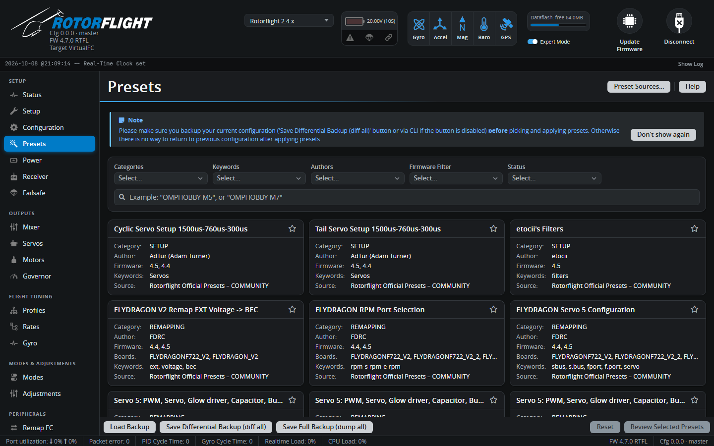

# Presets

Presets are ready-made snippets of configuration, shared by manufacturers
and pilots: board remapping, ESC telemetry setups, servo settings, filter
setups and complete tunes for particular helicopters. Applying one runs its
CLI commands on your flight controller.

!!! warning "Back up first"
    A preset changes your configuration, and there's no undo. Click **Save
    Differential Backup (diff all)** at the bottom of the tab before you
    apply anything. **Load Backup** puts it back.

## Finding a preset

Filter by **Categories** (Setup, Remapping, Tuning ...), **Keywords**,
**Authors**, **Firmware** version and **Status**, or type in the search box
-- a helicopter or board name usually works best, for example
`OMPHOBBY M7` or `NEXUS`. Only presets that match your firmware version and
board are useful; the card lists both.

Each card shows the category, author, firmware versions, boards and
source. The source's status tells you how much to trust it:

| Status | |
| --- | --- |
| **OFFICIAL** | From the Rotorflight team or a manufacturer. |
| **COMMUNITY** | Shared by pilots and reviewed before being added. |
| **EXPERIMENTAL** | Untested or work in progress. |

## Applying presets

1. Click a card. Read the description, pick from its **Options** if it has
   any, and use **Show CLI** to see exactly what it will change.
2. Click **Select**. You can select several presets; they are applied in
   order.
3. Click **Review Selected Presets**, check the list, then **Review CLI**.
4. Click **Execute**, then **Save and Reboot** when it's done.

If any command fails, you get a warning that the configuration was applied
with CLI errors -- check the output before saving.

## Preset sources

Presets are loaded from the
[rotorflight-presets](https://github.com/rotorflight/rotorflight-presets)
repository. **Preset Sources...** lets you add other repositories, for
example a club's or your own.

!!! danger
    A preset can change anything, including motor outputs. Only add sources
    you trust.

To share a preset with everyone, open a pull request on
[rotorflight-presets](https://github.com/rotorflight/rotorflight-presets).
