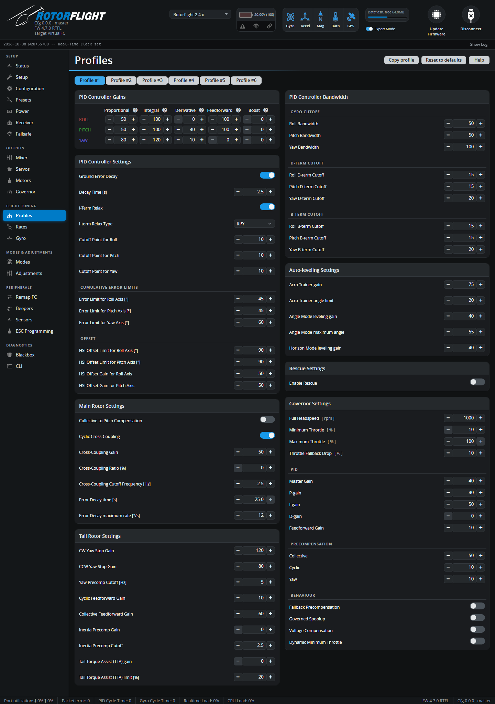

# Profiles

The Profiles tab holds the flight tune: the PID gains that decide how
tightly the helicopter follows your sticks, plus the helicopter-specific
compensations, self-levelling, rescue and the per-profile governor settings.

There are **six profiles**. Switch between them with the tabs at the top,
from a switch on your radio (see [Profile Switching](../../setup/profile-switching.md)),
or from the Lua suite -- for example a calm hover profile, a sport profile
and a 3D profile, each with its own headspeed. **Copy profile** copies
everything on this tab to another profile; **Reset to defaults** resets the
current one.

!!! note "PID mode"
    These settings are for PID mode 3, the default. If a warning says the
    controller is in another PID mode (4 is experimental), or set up in ways
    the tab can't show, use the CLI.

## PID Controller Gains

The P, I, D, F and B gains, per axis. The tune is in real units (degrees and
degrees per second), so -- if the [mixer is calibrated](../../setup/mixer.md)
-- the defaults are a sensible start on most helicopters.

Here's what each term does to how the helicopter flies, rather than the
textbook definition:

- **P** is how locked-in the helicopter feels -- how hard it pushes back
  when something moves it off where you asked. Too little and it feels soft
  and wanders, slow to settle after a gust. Too much and it gets nervous: a
  fast wobble or bounce after a sharp input. On yaw, too much P shows as a
  fast tail wag.
- **I** is what holds the helicopter where you put it -- a steady attitude
  in a hover, a straight line in forward flight, a heading that doesn't
  creep. On a helicopter it's a big part of the tune, which is why the
  defaults are high (100-120). Too little and it drifts off line, or the
  nose wanders on yaw. Too much and it wallows in a slow oscillation, or
  keeps rotating a moment after you centre the stick.
- **D** is the shock absorber: it damps any sudden rotation, whether from a
  stick input or a gust. It stops P overshooting. Too much makes servos
  buzz and run hot -- D amplifies vibration more than any other term, so
  fix noise with [Gyro](gyro.md) filtering first.
- **F** (feedforward) is what makes the stick feel direct. It moves the
  swashplate the moment you move the stick, instead of waiting for an error
  to build. Too little feels delayed and rubbery, and the helicopter keeps
  rotating briefly after you stop. Too much snaps past the target and
  kicks back ("strikeback") when you centre the stick.
- **B** (boost) adds to F while the stick is *moving*, reacting to how fast
  you move it rather than how far. A little gives crisp starts and stops to
  flips and rolls; too much is twitchy.

### Quick troubleshooting

| What you see in the air | Try |
| --- | --- |
| Feels soft, wanders, slow to settle | Raise P |
| Fast wobble or bounce after a sharp input | Lower P, or raise D |
| Tail wags quickly | Lower yaw P (check [Gyro](gyro.md) filtering) |
| Servos buzz or get hot | Lower D, check [Gyro](gyro.md) filtering |
| Stick feels laggy or rubbery | Raise F |
| Keeps rotating after you centre the stick | Raise F; if it's slow and wallowing, lower I |
| Kicks back as you centre the stick | Lower F, or raise [I-Term Relax](#pid-controller-settings) |
| Bounces back at the end of flips and rolls | Lower the I-Term Relax cutoff |
| Hover drifts slowly off position | Raise I; check the [Error Decay](#main-rotor-settings) time |
| Pitches up during fast forward flight or big collective pumps | Raise the HSI **Offset Gain** (O) -- see [High Speed Integral](../../tuning/high-speed-integral.md) |
| Tail stops are soft or bounce at the end of pirouettes | Adjust the [yaw stop gains](#tail-rotor-settings) |

See [Tuning](../../tuning/index.md) for the full tuning process.

### Why these defaults

| | P | I | D | F | B | O |
| --- | :-: | :-: | :-: | :-: | :-: | :-: |
| Roll | 50 | 100 | 0 | 100 | 0 | 50 |
| Pitch | 50 | 100 | 40 | 100 | 0 | 50 |
| Yaw | 80 | 120 | 10 | 0 | 0 | -- |

- **I is high and P is moderate.** A rotor disc behaves like a big
  gyroscope; the helicopter mostly needs holding steady against slow
  disturbances, which is I's job. I doesn't wind up unchecked: error
  decay, I-term relax and the error limits (below) manage it.
- **F = 100 on cyclic** gives a direct stick feel from the start: with a
  calibrated mixer, F alone produces most of the cyclic needed for a
  commanded rate, and P and I correct what's left.
- **Pitch starts with some D (40), roll with none.** Add roll D only if
  roll overshoots after you've tuned P and F -- every bit of D costs servo
  load.
- **Yaw F is 0**, because the tail gets its feedforward from the
  collective and cyclic precompensation and the stop gains instead.
- **O (HSI offset gain)** only acts at large collective, holding attitude in
  fast forward flight and hard collective changes.

## PID Controller Settings

| Setting | What it does |
| --- | --- |
| **Ground Error Decay** / **Decay Time** [s] | While the helicopter isn't airborne, bleeds off accumulated error so it can't tip itself over on the ground. Default 2.5 s. |
| **I-Term Relax** | Stops I building up during fast moves, which reduces bounce-back at the end of flips and rolls. **Type** RP (roll and pitch) or RPY (also yaw). |
| **Cutoff Point** (roll, pitch, yaw) | How strongly I-Term Relax acts -- *lower* suppresses more bounce-back, *higher* keeps more precision in fast continuous rotations. Roughly 15-30 for small helicopters, 10-15 mid-size, under 10 for large. Default 10. |
| **Error Limit** [°] | A hard cap on the accumulated angle error, and so on I. Defaults 45° roll/pitch, 60° yaw. |
| **HSI Offset Limit** [°] | Cap on the High Speed Integral offset. Default 90°. |
| **HSI Offset Gain** | The **O** term: an integral that only works at large collective, keeping attitude steady in fast flight and on big collective changes. Too low: unstable or diving at speed and on collective changes. Too high: restless or oscillating at high collective. |

## Main Rotor Settings

| Setting | What it does |
| --- | --- |
| **Collective to Pitch Compensation** / **Gain** | Mixes collective into elevator to cancel the nose pitching up on collective pumps. |
| **Cyclic Cross-Coupling** / **Gain** / **Ratio** / **Cutoff** | Cancels the roll wobble that pure elevator inputs cause through the rotor's gyroscopic coupling. *Ratio* adds the opposite (roll-to-pitch) correction; *Cutoff* sets how fast the compensation acts. See [Cyclic Cross-Coupling](../../tuning/cyclic-cross-coupling.md). |
| **Error Decay time** [s] | How quickly accumulated cyclic error (I) is bled off in flight. Longer holds a hover more steadily; shorter feels freer for 3D. Default 25 s. |
| **Error Decay maximum rate** [°/s] | The fastest that cyclic error can bleed off. Default 12. |

## Tail Rotor Settings

| Setting | What it does |
| --- | --- |
| **CW / CCW Yaw Stop Gain** | Extra P and D when stopping a pirouette, separately for each direction. One direction works with the main rotor torque and the other against it, so they need different values. Defaults 120 CW, 80 CCW; typical 50-200. |
| **Yaw Precomp Cutoff** [Hz] | How fast all yaw precompensation acts. |
| **Cyclic Feedforward Gain** | Tail pitch added for cyclic inputs, which load the main rotor. |
| **Collective Feedforward Gain** | Tail pitch added for collective -- the main way the tail anticipates torque changes. Default 60. |
| **Inertia Precomp Gain** / **Cutoff** | Tail pitch added as headspeed changes, to counter the rotor's inertia. Mainly for motorised tails. |
| **Tail Torque Assist (TTA) gain / limit** [%] | For motorised tails: briefly raises headspeed to help the tail when it needs to push harder than idle allows. *Limit* caps the increase. See [Motorised Tail & TTA](../../tuning/motorised-tail.md). |

## PID Controller Bandwidth

| Setting | What it does |
| --- | --- |
| **Roll / Pitch / Yaw Bandwidth** [Hz] | Overall bandwidth of the PID loop -- a low-pass filter on the gyro input to the controller. Defaults 50 / 50 / 100. |
| **D-term Cutoff** [Hz] | Filtering on the D-term. Defaults 15 / 15 / 20. |
| **B-term Cutoff** [Hz] | Filtering on the boost term. Defaults 15 / 15 / 20. |

## Auto-leveling Settings

Used by the self-levelling modes (see [Stability Modes](../../setup/stability-modes.md)):

| Setting | Default | |
| --- | :-: | --- |
| **Acro Trainer gain** / **angle limit** | 75 / 20° | Acro Trainer doesn't level the helicopter, but stops it tilting past the limit. |
| **Angle Mode leveling gain** / **maximum angle** | 40 / 55° | How hard Angle mode levels, and the most it lets the helicopter tilt. |
| **Horizon Mode leveling gain** | 40 | How hard Horizon mode levels near centre stick. |

## Rescue Settings

**Enable Rescue** turns on the RESCUE mode for this profile. When the RESCUE
switch is flipped, the helicopter levels itself, pulls up and climbs, then
holds a hover:

| Setting | Default | |
| --- | :-: | --- |
| **Flip to upright** | Flip | If rescue starts inverted, flip upright (**Flip**) or recover inverted (**No-Flip**). |
| **Pull-up Collective** / **Time** | 65% / 0.3 s | Collective for the first pull-up, and for how long. |
| **Climb Collective** / **Time** | 45% / 1.0 s | Collective for the climb, and for how long. |
| **Hover Collective** | 35% | Collective to hold afterwards -- set to your hover collective. |
| **Flip Fail Time** | 2.0 s | Rescue gives up if the flip isn't finished by then. |
| **Exit Time** | 0.5 s | Collective changes are smoothed for this long after rescue, so a sudden negative collective can't drive the helicopter into the ground. |
| **Leveling Gain** / **Flip-to-Upright Gain** | 100 / 200 | How aggressively it levels and flips. |
| **Max Levelling Rate** / **Acceleration** | 300 °/s / 3000 °/s² | Limits on how fast it rotates. Larger helicopters may need lower values. |
| **Enable Altitude Hold** and related | | Holds a set altitude with the barometer. |

See [Rescue](../../tuning/rescue.md) for setting it up and testing it.

## Governor Settings

The per-profile half of the governor (the global half is on the
[Governor](governor.md) tab). Shown when the governor is enabled.

| Setting | Default | What it does |
| --- | :-: | --- |
| **Full Headspeed** [rpm] | 1000 | The target headspeed at 100% throttle input. The governor aims for this × the throttle input -- so 100% throttle gives full headspeed, 90% gives 90% of it. |
| **Minimum Throttle** [%] | 10 | The least throttle the governor may use while active. |
| **Maximum Throttle** [%] | 100 | The most throttle the governor may use. |
| **Throttle Fallback Drop** [%] | 10 | If the RPM signal is lost, throttle drops by this much -- a noticeable sag so you know to land. |
| **Master Gain** | 40 | Overall strength of the governor PID. |
| **P / I / D-gain** | 40 / 50 / 0 | The governor PID gains. |
| **Feedforward Gain** | 10 | Overall strength of the precompensation. |
| **Precompensation: Collective / Cyclic / Yaw** | 50 / 10 / 10 | How much each control adds throttle before the headspeed sags, so the governor reacts before it has to. |
| **Fallback Precompensation** | off | Keep using precompensation in fallback. |
| **Governed Spoolup** | off | Use the PID during spoolup, rather than a plain ramp. |
| **Voltage Compensation** | off | Compensate for battery sag. Needs the Battery ADC as voltage source. Useful for packs with high internal resistance, such as Li-ion. |
| **Dynamic Minimum Throttle** | off | Stops the throttle dropping sharply in an overspeed, e.g. if a one-way bearing disengages in a descent. |

See [Governor Tuning](../../tuning/governor.md).
