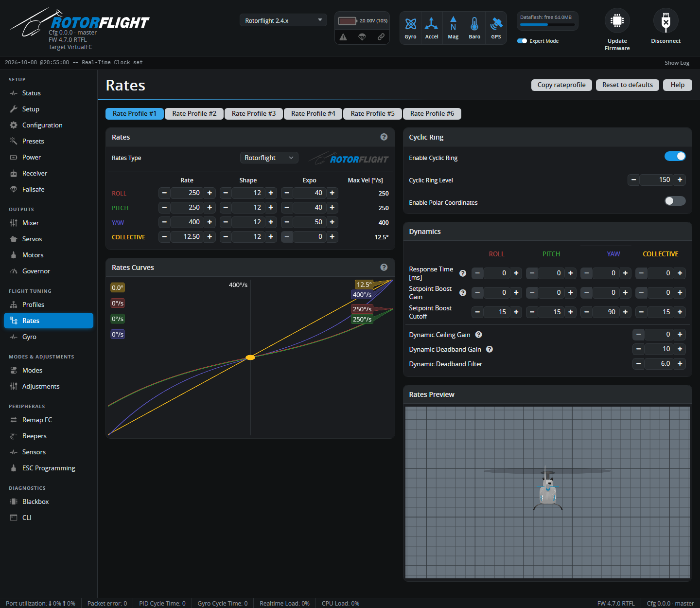

# Rates

Rates turn stick position into a requested rotation rate for roll, pitch
and yaw, and a blade pitch for collective. They're your stick feel. There
are **six rate profiles**, which can be switched in flight independently of
the PID profiles.

## Rates

**Rates Type** -- the formula used. **Rotorflight** is the default and the
one these docs describe. The Betaflight, Raceflight, KISS, Actual and Quick
types from the multirotor world are also available. Changing type resets
the curves to that type's defaults.

With **Rotorflight** rates each axis has three numbers:

| | What it sets | Default (cyclic / yaw / collective) |
| --- | --- | --- |
| **Rate** | The rate at full stick, in °/s -- or the blade pitch at full stick, in °, for collective. This is the **Max Vel** column. | 250 / 400 / 12.5° |
| **Expo** [%] | How much softer the centre is. 0 is a straight line; higher values make small stick movements gentler while full stick still reaches Rate. | 40 / 50 / 0 |
| **Shape** | How the expo curve bends. Higher values keep the centre flatter for longer and bring the rate in more sharply towards full stick. Only matters with Expo above 0. | 12 |

Pick **Rate** for how fast you want the helicopter to flip, roll and
pirouette at full stick, then **Expo** for how calm it feels around centre.

!!! tip "Collective rate"
    The **Collective** rate is the blade pitch at full collective stick --
    the equivalent of setting your pitch range in a radio or another
    flybarless system. It can't exceed the
    *Collective blade pitch limit* on the [Mixer](mixer.md) tab.

The **Rates Curves** chart plots each axis, and the **Rates Preview** model
shows the result live as you move the sticks.

## Cyclic Ring

Limits combined roll + pitch input, so pushing the stick into a corner
doesn't ask for more cyclic than either axis alone.

- **Enable Cyclic Ring** -- on by default.
- **Cyclic Ring Level** [%] -- 100% makes the limit a true circle; higher
  values relax it to allow more in the diagonals. Default 150%.
- **Enable Polar Coordinates** -- applies the rates to the combined stick
  direction and distance from centre, instead of to each axis separately.
  A tech preview.

## Dynamics

Per axis:

| Setting | What it does |
| --- | --- |
| **Response Time** [ms] | Smooths stick inputs. Higher values feel softer and more scale-like; 0 is instant. |
| **Setpoint Boost Gain** | Sharpens the response to quick stick movements, for a snappier feel. |
| **Setpoint Boost Cutoff** | How quickly the boost fades. |

For yaw only:

| Setting | What it does |
| --- | --- |
| **Dynamic Ceiling Gain** | When the stick is moving fast towards full deflection, reaches full rate with less stick travel. |
| **Dynamic Deadband Gain** / **Filter** | When the stick is moving fast back to centre, widens the deadband briefly -- helping crisp pirouette stops on sticks that overshoot centre. |
