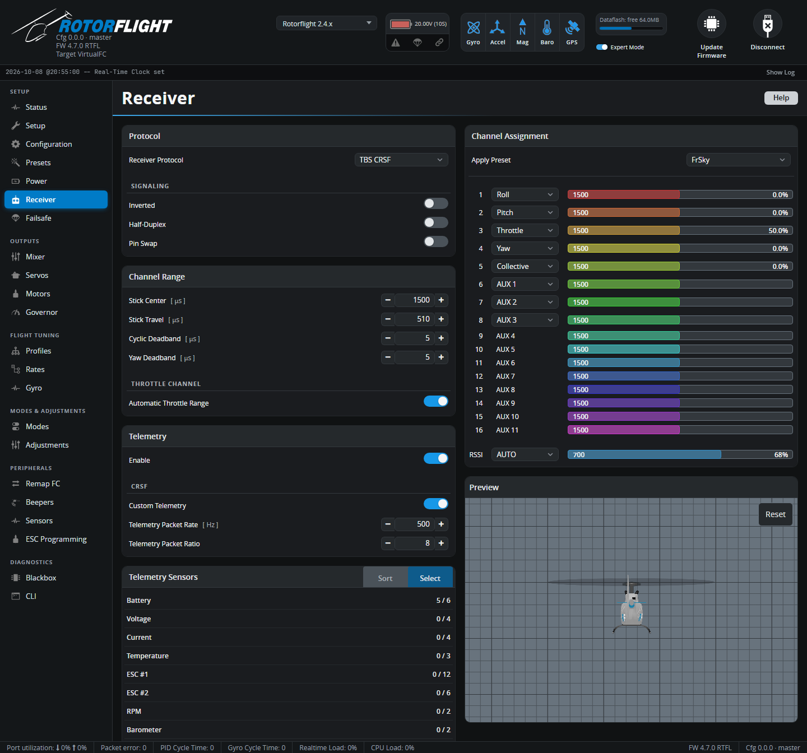

# Receiver

Receiver protocol, channel order, stick calibration and telemetry.

Before anything shows up here, set the UART your receiver is wired to to
**Serial Rx** on the [Configuration](configuration.md) tab, and save.

## Protocol

**Receiver Protocol** must match what your receiver sends:

| Receiver | Protocol | Wiring |
| --- | --- | --- |
| ExpressLRS, TBS Crossfire / Tracer | **TBS CRSF** | Receiver TX → FC RX, receiver RX → FC TX |
| FrSky (F.Bus capable: Archer, ACCESS ...) | **FrSky FBUS** | One wire to FC **TX**; *Half-Duplex* and *Inverted* on |
| FrSky F.Port | **FrSky F.PORT** / **F.PORT2** | One wire to FC **TX**; *Half-Duplex* and *Inverted* on |
| Futaba, FrSky, others with SBUS | **Futaba S.BUS** | SBUS → FC **RX**; *Inverted* on |
| Futaba SBUS2 | **Futaba S.BUS2** | One wire to FC **TX**; *Half-Duplex* and *Inverted* on |
| Spektrum SRXL2 receivers | **Spektrum DSM/SRXL2** | One wire to FC **TX** |
| Spektrum satellites (DSMX) | **Spektrum DSM/2048** | Satellite → FC **RX**, 3.3 V supply |
| FlySky | **Flysky IBUS** / **IBUS2** | IBUS → FC **RX** |
| Jeti | **Jeti EXBUS** | One wire to FC **TX** |
| JR / XBus | **JR XBUS Mode A / B** or **XBUS/RJ01** | XBUS → FC **RX** |
| Graupner HoTT | **Graupner SUMD** | SUMD → FC **RX** |
| ImmersionRC Ghost | **ImmersionRC GHOST** | One wire to FC **TX** |

Receivers with telemetry built into the link (CRSF/ELRS, F.Bus, F.Port,
SRXL2, iBUS2, EXBUS, Ghost) let you tune from your radio with the
[Lua suites](../../radio/index.md). With other receivers, add a separate
telemetry wire (for example S.Port alongside SBUS -- see
[Configuration](configuration.md#serial-ports)) or use
[Adjustments](adjustments.md).

!!! tip "Flight controllers with a built-in receiver connector"
    Rotorflight flight controllers usually have a port labelled for the
    receiver, already set up correctly. Check your flight controller's
    [hardware page](../../hardware/index.md).

### Signaling

| Option | Use |
| --- | --- |
| **Inverted** | Un-inverts SBUS, F.Port and F.Bus, which are inverted signals. |
| **Half-Duplex** | Sends and receives on the TX pin -- for single-wire protocols such as SBUS2, F.Port, F.Bus, SRXL2. |
| **Pin Swap** | Swaps the UART's RX and TX pins. |

**Inverted** and **Pin Swap** need an F7, G4 or H7 flight controller. F4
processors can't invert a UART: use a non-inverted signal from the
receiver, or a pad the board maker has fitted with an inverter.

**Bind Receiver** appears when the flight controller can bind the selected
receiver itself, for example Spektrum receivers and built-in SPI receivers.

## Channel Assignment

The flight controller needs to know which channel is which. Pick the
**Apply Preset** that matches your radio, then check every bar moves with
the right stick:

| Channel | ELRS | FrSky | Futaba / Hitec | Spektrum / Graupner / JR |
| :-: | --- | --- | --- | --- |
| 1 | Roll | Roll | Roll | Throttle |
| 2 | Pitch | Pitch | Pitch | Roll |
| 3 | Collective | Throttle | Throttle | Pitch |
| 4 | Yaw | Yaw | Yaw | Yaw |
| 5 | **AUX 1** (arm) | Collective | AUX 1 | AUX 1 |
| 6 | Throttle | AUX 1 | Collective | Collective |
| 7+ | AUX 2... | AUX 2... | AUX 2... | AUX 2... |

Any other order works too: pick the function for each channel from its
drop-down.

!!! note "ELRS: arm on channel 5"
    With ExpressLRS, the arm switch must be on channel 5 (AUX 1). ELRS uses
    it to know the model is armed, and sends it with every packet.

Rotorflight has separate **Collective** and **Throttle** channels. Set up a
collective pitch curve and a throttle curve (or a flat throttle with the
[governor](governor.md)) in your radio, on their own channels -- don't mix
pitch into throttle.

The bar directions must be:

| Stick | Bar moves |
| --- | --- |
| Right stick right (roll right) | Roll to the right (positive) |
| Right stick forward (pitch forward) | Pitch to the right (positive) |
| Rudder right (yaw right) | Yaw to the right (positive) |
| Collective up | Collective to the right (positive) |
| Throttle up | Throttle to the right |

If one goes the wrong way, reverse that channel in your radio. Don't use
radio trims on cyclic or yaw -- keep them at zero.

**RSSI** sets where signal strength comes from: **AUTO** for protocols that
report it, a channel, or **ADC** for a receiver's analogue RSSI output.

The **Preview** shows how the stick inputs turn into rotation rates through
your [Rates](rates.md). With the **MSP** receiver protocol, **Control sticks**
opens virtual sticks to drive the flight controller from the Configurator.

## Channel Range

| Setting | Meaning |
| --- | --- |
| **Stick Center** [µs] | The channel value with the stick centred. 1500 for most radios, 1520 for Futaba and some older ones. |
| **Stick Travel** [µs] | How far a full stick throw moves from centre. 510 suits most radios (988-2012 µs). If full stick doesn't reach 100%, lower it; if it reaches 100% before the end of the stick, raise it. |
| **Cyclic Deadband** / **Yaw Deadband** [µs] | How far the stick must move from centre before it counts. Raise it if the helicopter creeps with the sticks centred -- watch the Preview. Default 5. |

### Throttle channel

With **Automatic Throttle Range** on (the default), 0% and 100% throttle are
worked out from the stick centre and travel. Turn it off to set **Min
Throttle - 0%** and **Max Throttle - 100%** yourself, for radios whose
throttle channel doesn't use the full range.

The flight controller only arms when the throttle is at least 10 µs below
0%. Your throttle hold must send a value below that.

## Telemetry

**Enable** turns the telemetry stream to your radio on or off. Further
options depend on the protocol:

- **Inverted / Half-Duplex / Pin Swap** -- for a separate telemetry port,
  e.g. S.Port.
- **CRSF: Custom Telemetry** -- sends Rotorflight's own sensor set over
  ELRS, instead of the few sensors CRSF has room for. The radio needs a Lua
  script to decode it; see [ELRS Custom Telemetry](../../setup/elrs-custom-telemetry.md).
  Set **Telemetry Packet Rate** and **Telemetry Packet Ratio** to the same
  values as your ELRS transmitter module.

## Telemetry Sensors

Choose which sensors are sent. **Select** lists them by group (battery,
ESC, RPM, governor, profiles...); **Sort** sets the order they're sent in,
for protocols where it matters -- put the sensors you want updated most
often first. There's a limit to how many fit; the tab warns you when
you've exceeded it.

The Lua suites use specific sensors for their dashboards. The presets
*Set telemetry sensors for RFsuite on Ethos* and *Set basic parameters for
radio setup EdgeTX* on the [Presets](presets.md) tab pick the right ones.
See [Telemetry Sensors](../../reference/telemetry.md) for the full list.
