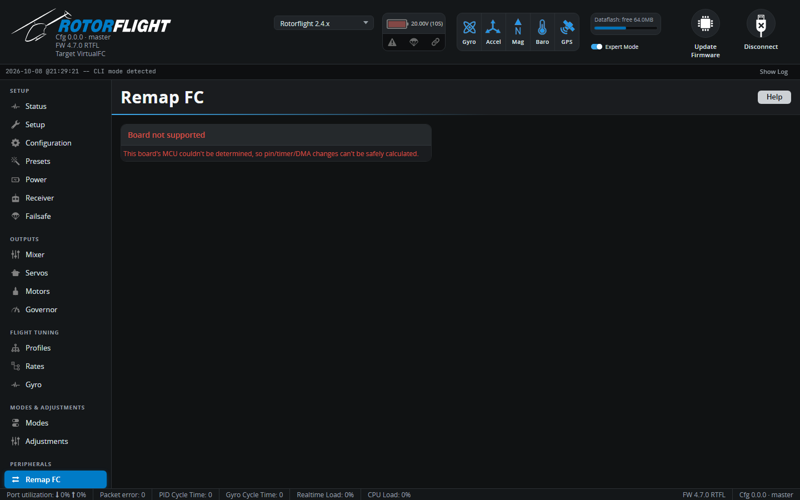

# Remap FC

!!! info "New in 2.4"

Remap FC changes which pin on the flight controller does which job --
without a soldering iron or CLI `resource` commands. Swap a tail servo
output for a motorised tail ESC, add an output for a buffer pack or glow
driver, or move a function to a free pin.

!!! warning "Back up first"
    Remapping rewrites the board's pin, timer and DMA assignments. Take a
    [backup](../../getting-started/backup-and-restore.md) before you start.

## Using it

1. Click **Read FC**. The Configurator reads the board's current pin
   assignments and works out what each pin can do.
2. Click a pin to see its options. Each pin card says what it does now and
   what it's commonly used for:

    | Output | Usual purpose |
    | --- | --- |
    | **M1** | Main ESC, or the throttle servo for nitro and turbine. |
    | **M2** | Tail motor ESC, for a motorised tail. |
    | **S1 / S2 / S3** | Cyclic servos. |
    | **S4** | Tail servo, for a mechanical tail. |
    | **FREQ1** | Main RPM sensor input, for the governor and RPM filter. |
    | **LED** | LED strip. |
    | **TLM**, **SBUS** | Serial ports -- usually ESC telemetry and SBUS receiver. |

3. Pick the new function for the pin. Picking a function that's already
   elsewhere moves it here; picking the pin's own default puts it back.
   *Other Pins* lists pins that aren't on the board's labelled connectors.
4. The Configurator calculates timers and DMA for the new layout. If a
   combination can't work, it explains why and offers suggestions -- for
   example swapping two functions' pins. **Accept Suggestion** applies one.
5. Check **Pending Changes**, then send them to the flight controller.

### Rules it enforces

- **No gaps in motor and servo numbering.** The flight controller stops at
  the first unassigned output, so with S1, S2 and S4 but no S3, S4 would be
  silently dropped. Close the gap first.
- **Servos sharing a timer share a rate.** The *Servo frequency groups*
  section shows which servos must be changed together, to the same update
  rate.
- **Hard-wired pins** can't be moved.

The remapper needs to know the board's processor. If it can't (an
unsupported MCU), it won't make changes -- use the CLI `resource` commands
instead, as described in [Remapping Outputs](../../setup/remapping.md).
