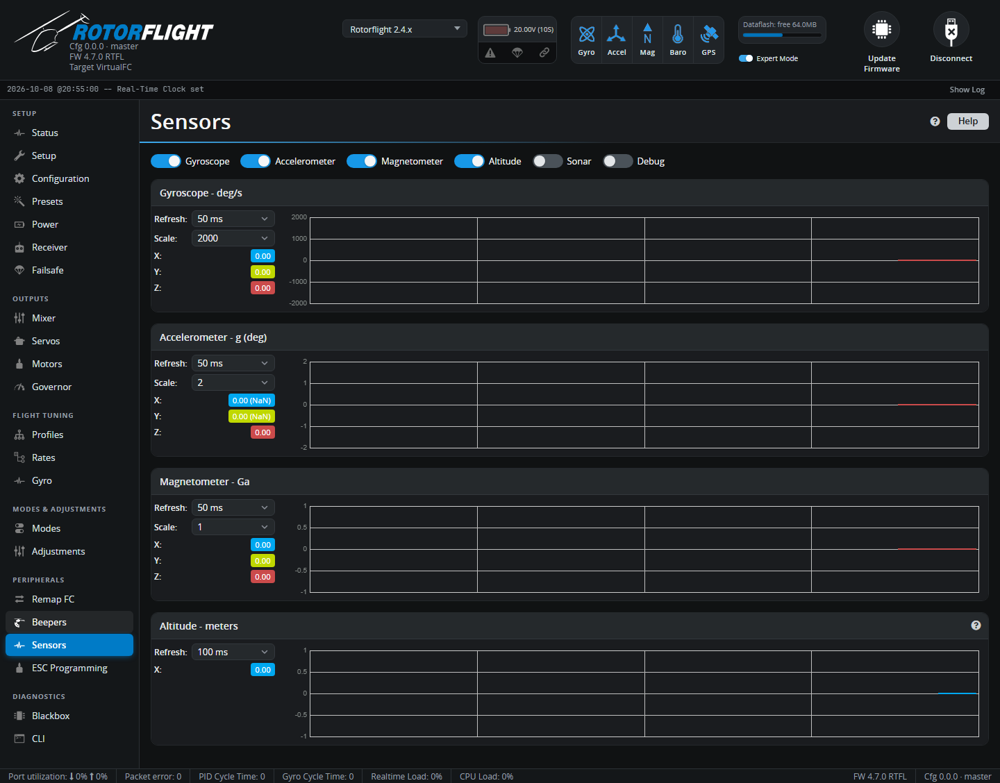

# Sensors

Live graphs of the raw sensors: gyro, accelerometer, magnetometer,
altitude and the debug values.

Tick the sensors to show. Each graph has a **Refresh** rate and a
**Scale**. Graphs at fast refresh rates are heavy on the computer, so only
show what you need.

Uses on a helicopter:

- **Gyroscope** -- check the gyro is quiet when the helicopter is still,
  and responds on the right axis when you rotate it.
- **Accelerometer** -- check the level reading.
- **Altitude** -- from the barometer, combined with GPS altitude if a GPS has
  a fix. Absolute while disarmed, relative to the arming point while armed.
- **Debug** -- the eight values selected by *Debug mode* on the
  [Blackbox](blackbox.md) tab, for troubleshooting.

For vibration analysis, a [Blackbox](blackbox.md) log of a real flight
tells you far more than this tab can.
