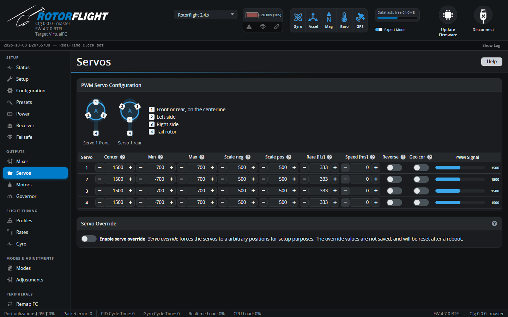

# Servos

Electrical setup for each servo output: centre, travel, scaling, update
rate and direction.

!!! tip "Step-by-step"
    For the full procedure -- centring, direction and calibration -- see
    [Servo Setup](../../setup/servos.md).

!!! danger "Check the Rate and Center before plugging servos in"
    A wrong update rate can burn out a servo, and narrow-band tail servos
    can be driven past their end stops at the wrong centre. Set both first,
    then connect the servos.

The diagram at the top shows which output goes where on the swashplate (the
same as on the [Mixer](mixer.md) tab).

## PWM Servo Configuration

| Column | Meaning |
| --- | --- |
| **Center** [µs] | The pulse that puts the servo arm level. Start from the servo's neutral -- **1520** for most cyclic servos, **760** for narrow-band tail servos -- then fine-tune so the arm is exactly level. |
| **Min** / **Max** [µs] | Travel limits each side of centre (for example -700 / +700). Use them to stop the arm or linkages binding at the extremes. With a 760 µs servo use about -350 / +350. |
| **Scale neg** / **Scale pos** [µs] | How far the pulse moves for a given commanded angle, each side of centre. 500 suits 1520 µs servos (about 10 µs per degree) and 250 suits 760 µs servos. Adjust one side so the arm moves the same angle each way -- see [calibrating servos](../../setup/servos.md). |
| **Rate** [Hz] | Pulse rate. **Check the servo's data sheet**: typically 333 Hz for digital cyclic servos and 560 Hz for narrow-band tail servos. Analogue servos must be 50 Hz. Needs a reboot. |
| **Speed** [ms] | Slows the servo down: the time for 60° of travel. 0 = no limit. Only for things like retracts -- leave flight servos at 0. |
| **Reverse** | Reverses the servo. Use it so that every servo moves the right way (see below). |
| **Geo cor** | Geometry correction: compensates for the servo arm moving in an arc, so the swashplate moves linearly near the ends of travel. Use the same setting for all swashplate servos. Not for linear servos. |
| **PWM Signal** | Live output, in µs. |

The tab warns you if the limits, scales, rates or geometry correction look
unusual, or if a centre close to one end limits how far the servo can
travel.

### Servo direction

Enable the override and move each servo's slider to a **positive** angle.
For the swashplate servos (1-3), the servo arm must move **up, towards the
swashplate**. If it moves down, tick **Reverse**. Set the tail servo's
direction on the [Mixer](mixer.md) tab, not here, once the tail is linked
up.

## Bus Servo Configuration

With S.BUS Output or F.BUS master enabled on the
[Configuration](configuration.md) tab, a second table configures **bus
servos** (outputs 9-26). Each has a **Source**:

- **Mixer** -- driven by the flight controller's mixer, like a PWM servo.
  The default for the first 8 bus outputs.
- **RX** -- passes a receiver channel straight through, for accessories such
  as lights or a winch.

See [FBUS Master](../../setup/fbus-master.md).

## Servo Override

**Enable servo override** shows a slider per servo, to move it to an exact
angle from the Configurator. Overrides aren't saved, are cleared on reboot,
and block arming while on.
