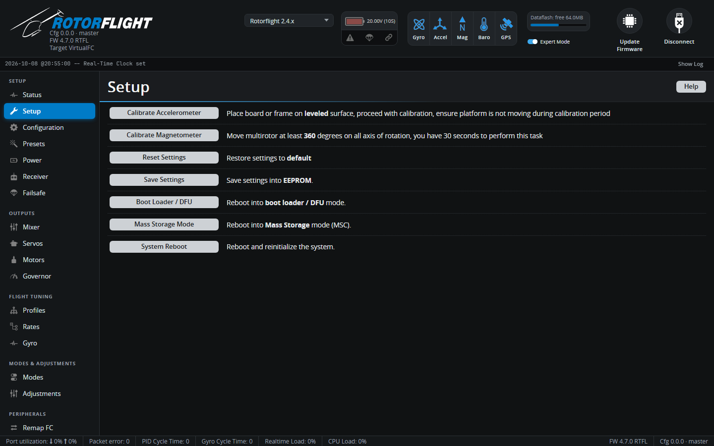

# Setup

Calibration and maintenance actions for the flight controller.

## Calibrate Accelerometer

The accelerometer tells the flight controller which way is down. It's used
by the self-levelling features -- Angle, Horizon, Acro Trainer and
Rescue -- and the `ACC_CALIB` arming flag stays set until it has been
calibrated.

1. Install the flight controller in the helicopter.
2. Stand the helicopter on a level surface, with the main shaft vertical
   (check with a level on the swashplate or the frame).
3. Click **Calibrate Accelerometer** and don't touch the helicopter for a
   couple of seconds.

Calibrate again whenever you remount the flight controller. Small drifts in
Angle or Rescue mode are then trimmed out with the
[accelerometer trims](configuration.md#accelerometer-trim), not by
recalibrating.

!!! note
    If you don't use any self-levelling mode, you can switch the
    accelerometer off on the [Configuration](configuration.md) tab instead.

## Calibrate Magnetometer

Only shown on boards with a compass. Click the button, then rotate the
helicopter through a full turn around all three axes within 30 seconds. The
compass is used for telemetry only.

## Reset Settings

Restores all settings to the defaults for your board. You're asked to
confirm. [Take a backup](../../getting-started/backup-and-restore.md) first.

## Save Settings

Writes the current settings to the flight controller's flash. The other
tabs save for you, so you'll rarely need this.

## Boot Loader / DFU

Reboots the flight controller into its DFU bootloader for flashing, as if
you'd held the BOOT button. It stays in DFU until it's flashed or power
cycled.

## Mass Storage Mode

Reboots the flight controller as a USB drive, so you can copy
[Blackbox](blackbox.md) logs straight from its flash chip or SD card.
Power cycle to return to normal.

## System Reboot

Restarts the flight controller.
