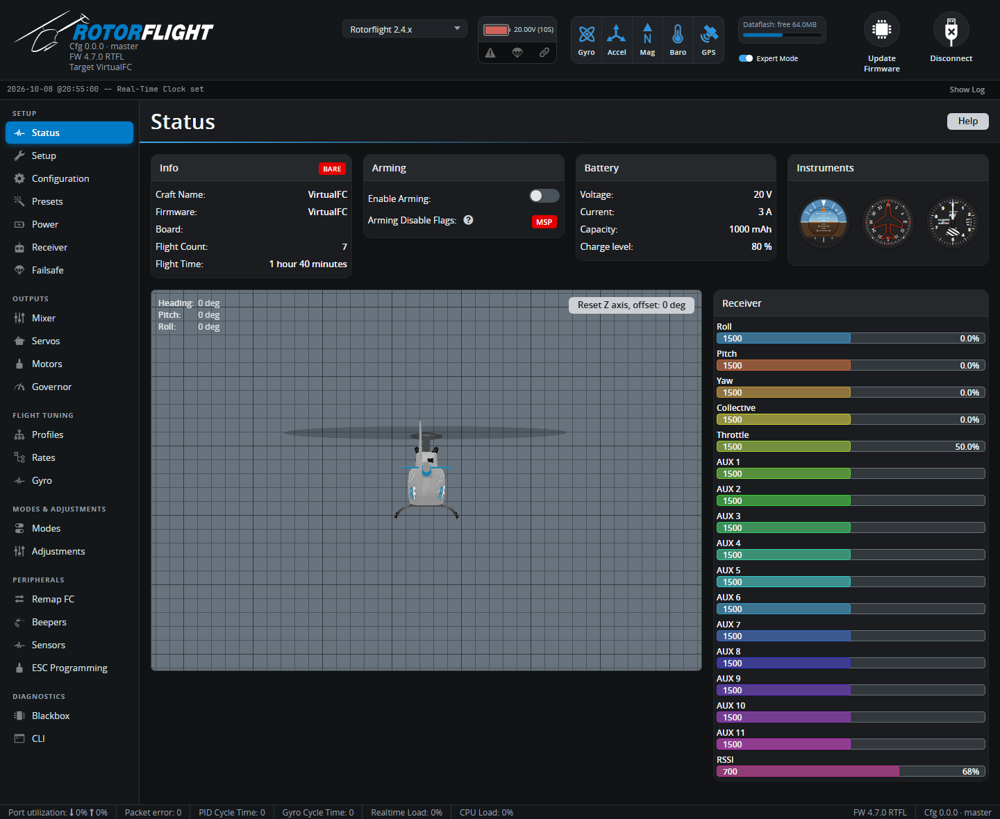

# Status

The Status tab opens when you connect. It's a dashboard of what the flight
controller is doing right now: its identity, why it won't arm, the battery,
its attitude, and what it's receiving from your radio.

## Info

| Field | Shows |
| --- | --- |
| **Badge** | `CONFIGURED`, `DEFAULTS` or `BARE` -- whether the board has a saved setup, factory defaults for its board, or no board configuration at all. A `BARE` board needs flashing with its board selected; see [Flashing the Firmware](../../getting-started/flashing-the-firmware.md). |
| **Craft Name** | The name set on the [Configuration](configuration.md) tab. |
| **Firmware** | Firmware version and build. |
| **Board** | The board configuration that was flashed. |
| **Flight Count / Flight Time** | Lifetime statistics, if [flight statistics](configuration.md#flight-statistics) are on. |

## Arming

- **Enable Arming** lets the flight controller arm while the Configurator is
  connected, for bench tests. You're asked to confirm, and a red warning
  banner stays up until you switch it off.

    !!! danger
        With arming enabled, the motor can start. **Remove the blades.**
        Never fly with the Configurator connected.

- **Arming Disable Flags** lists everything currently stopping the
  helicopter arming. `MSP` is always there while the Configurator is
  connected. Hover over a flag for a short description, or see the full
  list on [Arming & Safety](../../getting-started/arming.md#arming-disable-flags).

## Battery

Voltage, current, consumed capacity and charge level, as configured on the
[Power](power.md) tab. With a USB-only connection these read close to zero.

## Model and instruments

The 3D helicopter and the attitude, heading and altitude instruments follow
the flight controller's attitude estimate. Tilt and turn the helicopter --
the model must move the same way. If it doesn't, the board orientation is
wrong: fix it under **Board and Sensor Alignment** on the
[Configuration](configuration.md) tab.

**Reset Z axis** zeroes the displayed heading, to line the model up with
the real helicopter. It only affects the display.

## Receiver

Live channel values from the receiver, in µs and as a percentage: Roll,
Pitch, Yaw, Collective, Throttle and the AUX channels. Move each stick and
switch and check the right bar moves, in the right direction. See
[Receiver](receiver.md) to change the channel order or protocol.
