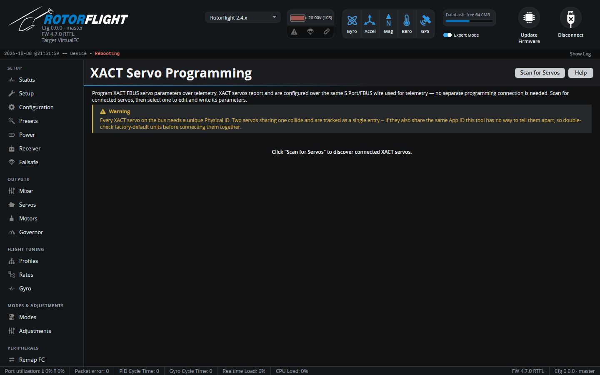

# XACT Servo Programming

!!! info "New in 2.4"

Programs FrSky XACT servos over the F.Bus wire they're connected on -- no
separate programming cable.

The tab appears when an F.Bus link is set up: either F.Bus as the receiver
protocol, or a UART set to **F.BUS** (master) on the
[Configuration](configuration.md) tab. See [FBUS Master](../../setup/fbus-master.md).

## Using it

1. Disarm. The flight controller refuses to scan or write while armed.
2. Click **Scan for Servos**. Every XACT servo found on the bus is listed
   with its channel, **Physical ID** and **App ID**.
3. Select a servo, change its parameters -- for example direction
   (clockwise / anticlockwise) and working mode (angle, range or rotate) --
   and write them back.

!!! warning "Unique IDs"
    Every XACT servo on the bus needs its own Physical ID. Two servos with
    the same ID show up as one, and if they also share an App ID the tool
    can't tell them apart. Factory-fresh servos often share defaults, so
    connect and set them up one at a time.
