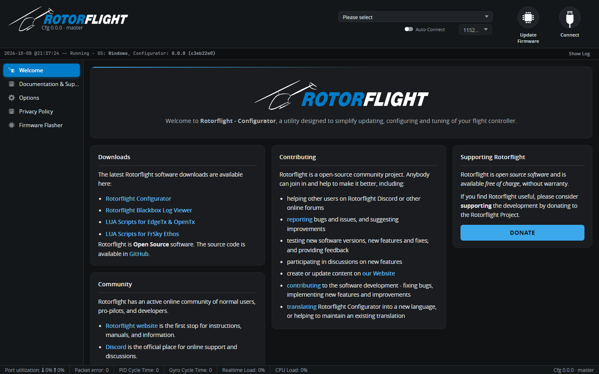

# First Connection

Once the firmware is flashed, connect from the main Configurator window.

## Connecting

1. Plug in the flight controller over USB. You don't need a battery for
   most setup work -- USB powers the board, though not the servos.
2. Pick its port in the port picker at the top of the window. In the browser
   the first connection asks you to grant access to the device.
3. Click **Connect**.

The Configurator opens on the [Status](../configurator/tabs/status.md) tab.

!!! tip "Try it without hardware"
    The port picker also has a **Virtual** entry. It connects to a simulated
    flight controller, so you can look around every tab without a board.
    Settings saved to the Virtual FC aren't kept.

## If the version isn't supported

If the board runs firmware the Configurator doesn't understand -- a much
older or newer Rotorflight, or Betaflight -- it shows a warning and opens in
**CLI mode**. You can still take a backup from the CLI, then
[flash](flashing-the-firmware.md) a matching Rotorflight version.

## Expert Mode

The **Expert Mode** switch at the top shows advanced settings and extra tabs
that most setups don't need. The screenshots in these docs are taken with it
on, so you may see fewer fields until you enable it.

## What to check first

- **Status tab**: the 3D helicopter should move the same way as the flight
  controller when you tilt and rotate it. If it doesn't, set the board
  orientation on the [Configuration](../configurator/tabs/configuration.md)
  tab.
- **Sensor indicators** at the top: Gyro and Accel should be lit.
- **Arming Disable Flags** on the Status tab: `MSP` is always set while the
  Configurator is connected. The others tell you what still needs setting up
  -- see [Arming & Safety](arming.md).

Then carry on with the [Setup Guides](../setup/index.md).
