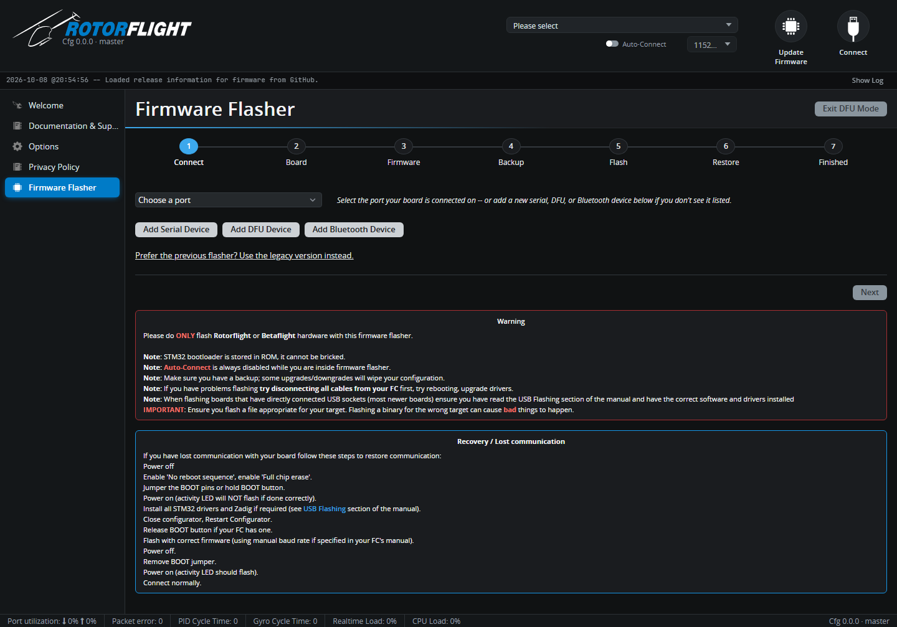

# Flashing the Firmware

Firmware is flashed from the Configurator's **Firmware Flasher**, opened with
the **Update Firmware** button at the top right. You can flash with nothing
connected, or after connecting to a board that is already running Rotorflight
or Betaflight.

## How Rotorflight firmware is built

Rotorflight uses *unified targets*: there is one firmware file per processor
family (STM32 F4, F7, G4 and H7), and a small *board configuration* that
tells the firmware which pins drive the servos, motors, UARTs and sensors on
your particular board. The Configurator combines the two when it flashes, so
you only ever pick your **board** -- the right firmware comes with it.

## The flashing wizard

The wizard has seven steps, shown along the top. **Back** and **Next** move
between them.

1. **Connect** -- choose the port your board is on. If it isn't listed, use
   **Add Serial Device**, **Add DFU Device** or **Add Bluetooth Device**. In
   the browser, these open the browser's device chooser to grant access.
2. **Board** -- **Detect My Board** reads the board from a connected flight
   controller. Choose it from the list yourself if detection fails, or if
   the board is in DFU mode (DFU can't be auto-detected).
3. **Firmware** -- **Load Online** fetches a build for your board: pick a
   release, or enable snapshots to see development builds. **Load Local**
   flashes a `.hex` file (and optional `.config`) you already have.
4. **Backup** -- **Back Up Now** captures your current settings as a `diff`
   (only changed settings) or `dump` (every setting). The backup is held by
   the wizard and offered back to you in the Restore step. **Save Backup
   File...** keeps a copy on disk, which is strongly recommended.
5. **Flash** -- a summary of board and version. Tick **Full chip erase** to
   wipe all settings stored on the board, then start the flash.
6. **Restore** -- once the new firmware boots, **Restore Now** replays the
   backup from step 4. **Skip** leaves the board on defaults.
7. **Finished** -- the update is complete and it's safe to disconnect.

**Flash Another Board** starts over. The link on the Connect step switches to
the older single-page flasher if you prefer it.

!!! warning "Updates can reset your configuration"
    When a new firmware finds settings it cannot read, it discards them and
    starts from defaults. Between major versions some settings also change
    meaning. Always take a backup, and read the
    [Upgrade Notes](upgrade-notes.md) before restoring an older backup onto a
    new major version.

!!! tip "When to use Full chip erase"
    Use it when moving a board from Betaflight to Rotorflight, when moving
    between major Rotorflight versions, and whenever the Configurator
    recommends it (for example if the board name stored on the board is
    wrong). It does no harm if you have a backup to restore.

## DFU mode

All supported flight controllers can be flashed through the STM32's built-in
DFU (Device Firmware Upgrade) bootloader. The Configurator normally reboots
the board into DFU for you. If that fails, enter DFU by hand:

1. Unplug the board.
2. Hold the **BOOT** button (or bridge the boot pads) while you plug in USB.
3. On the Connect step pick the **DFU** device, or use **Add DFU Device**.
4. Choose your board manually, load the firmware and flash.

A DFU connection is enough to flash, but board detection, backup and restore
need a normal serial connection.

The STM32 bootloader lives in ROM, so a flight controller cannot be
"bricked" by a bad flash -- you can always get back to DFU with the BOOT
button. **Exit DFU Mode** at the top right restarts a board that is sitting in
DFU.

## USB drivers

macOS, Linux, Android and the web Configurator need no extra drivers. On
Windows with the desktop app:

- For the normal serial connection, install the
  [STM32 Virtual COM Port driver](https://www.st.com/en/development-tools/stsw-stm32102.html)
  if the board doesn't show up as a COM port.
- For DFU, the *STM32 BOOTLOADER* device needs the **WinUSB** driver. Put the
  board in DFU, run [Zadig](https://zadig.akeo.ie/), choose *Options > List
  All Devices*, select *STM32 BOOTLOADER* and install **WinUSB**.
- The [ImpulseRC Driver Fixer](https://impulserc.com/pages/downloads) fixes
  most driver problems in one step.

## Troubleshooting

**Stuck at "Initiating reboot to bootloader", or "Rebooting device to
bootloader: FAILED".**
The board didn't come back in DFU, or Windows has no driver for it. Enter
DFU by hand (above) and check the DFU driver.

**The board no longer connects over USB after flashing.**
Usually the wrong board was selected, so USB isn't where the firmware
expects it. Enter DFU with the BOOT button, enable **Full chip erase** and
flash again with the correct board.

**My board isn't in the list.**
Check the [Hardware](../hardware/index.md) pages. Betaflight boards that
aren't listed can often run Rotorflight with a custom board configuration --
see [Betaflight FC (DIY)](../hardware/betaflight-diy.md).
