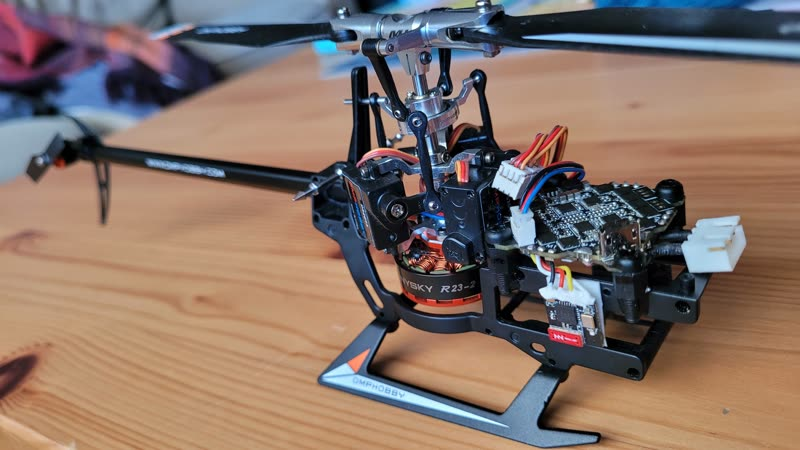
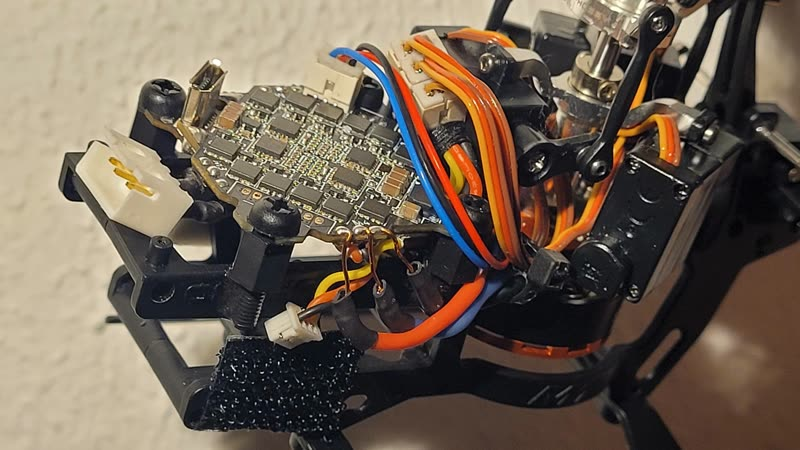
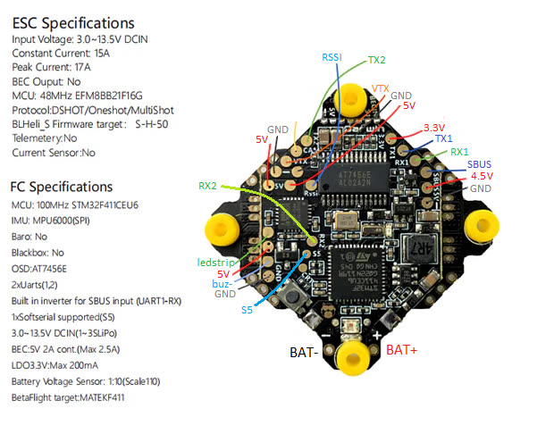
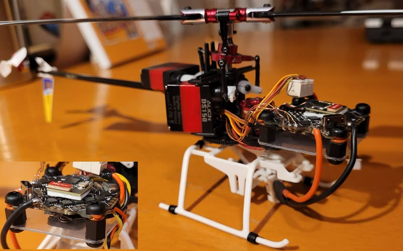

# Betaflight FC (DIY)

Rotorflight grew out of Betaflight, so most Betaflight flight controllers
can run it. They're made for quadcopters -- four motors, no servos -- so they
need some work:

1. [Flash Rotorflight](../getting-started/flashing-the-firmware.md), choosing
   the board's Betaflight target name.
2. [Remap the outputs](../setup/remapping.md) for servos, motors and an RPM
   input.
3. Solder the servo, ESC and receiver connections to the pads.

See [Hardware](index.md#betaflight-flight-controllers) for what to look for
in a board.

## Example: OMPHobby M1 with a DarwinFPV 15A AIO

The OMPHobby M1 is a small (about 120 g) helicopter with brushless main and
tail motors. Here its stock electronics are replaced by a
[DarwinFPV 15A](https://darwinfpv.com/products/darwinfpv-15a-1-3s-f411-ultralight-whoop-aio)
"whoop" all-in-one board -- flight controller and four ESCs -- with a
[BETAFPV ELRS Lite](https://betafpv.com/products/elrs-lite-receiver)
receiver.

- 15 A continuous (17 A peak) is plenty for the main motor.
- The 2 A 5 V BEC powers the servos.
- There are enough pads for three servos, the receiver and an
  [OpenLager](../setup/openlager.md).

The version of this board with a built-in ELRS receiver can't be used: its
receiver is on SPI.



### Build notes

- The board is mounted on plastic M3 standoffs glued to the frame.
- The servo connectors are three Molex PicoBlade headers glued together
  (like the [PicoBlade LED bus](../setup/led-strip.md#a-picoblade-led-bus)),
  wired to the board with 28 AWG power and 30 AWG signal wires, and
  reinforced with epoxy.
- Wires soldered to the board are secured with electronics-safe silicone.
- The ESCs run [Bluejay](../setup/blheli-s-to-bluejay.md), for bidirectional
  DShot RPM.
- The pre-soldered capacitor was removed.



### Remapping

```
resource MOTOR 1 B07   # main motor, on the M4 pad
resource MOTOR 2 B04   # tail motor, on the M1 pad
resource MOTOR 3 NONE
resource MOTOR 4 NONE
resource SERVO 1 A00   # RSSI pad
resource SERVO 2 B03   # S5 pad
resource SERVO 3 A08   # LED strip pad
resource LED_STRIP 1 NONE
```

ELRS is on RX1/TX1 and the 4.5 V pad (so it's powered on USB too); the
OpenLager on TX2.



The complete configuration: [m1-darwinfpv-diff-all.txt](files/m1-darwinfpv-diff-all.txt)
(Rotorflight 2.x era -- for reference).

## Sensitive gyros

Some boards -- including some DarwinFPV 15A batches -- use the MPU-6500 gyro,
which copes badly with vibration. Hard-mounted, it shows up as a noisy,
twitchy gyro trace. Soft-mount the board, for example with rubber O-rings
around the mounting screws.

{ width="480" }

To see which gyro you have, run `status` in the CLI and look for the
`GYRO=` field, for example `GYRO=MPU6500, ACC=MPU6500`.
