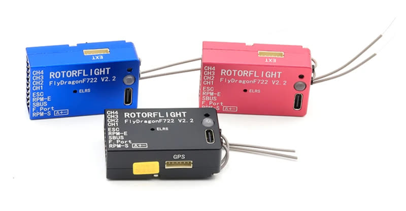
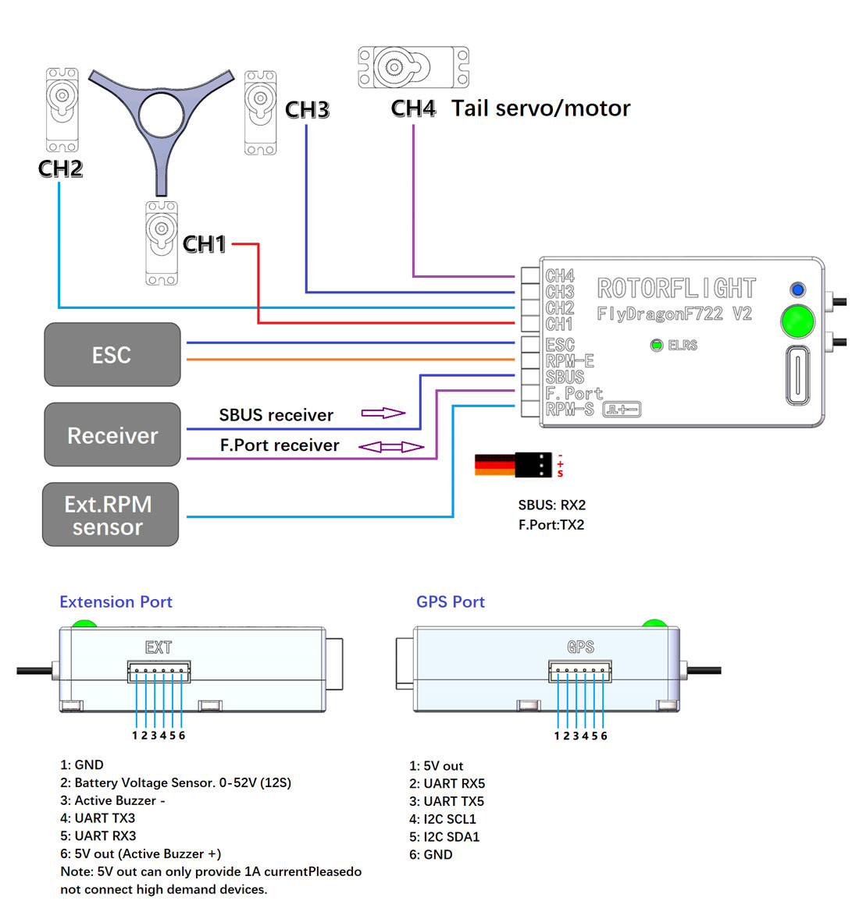

# FlyDragon

## FlyDragon F722 V2.2



| | |
| --- | --- |
| **Board** | `FLYDRAGON_V2_2` (older: `FLYDRAGON_V2`, `FLYDRAGON_V1`) |
| MCU | STM32F722RET6 |
| Gyro | BMI270 |
| Blackbox | 128 MB flash (W25N01G) |
| Barometer | SPL06 |
| Servo outputs | CH1-CH4 |
| RPM inputs | RPM-E (ESC RPM wire), RPM-S (separate RPM sensor) |
| UARTs | UART1 internal receiver; UART2 SBUS/F.Port connector; UART3 extension port; UART5 GPS port |
| Built-in receiver | ExpressLRS 2.4 GHz diversity, on UART1 |
| Other | WS2812 LED, 5 V buzzer, USB-C |
| BEC input | 5-15 V; 5 V output 1.5 A |
| Size, weight | 45 × 27 × 14.5 mm, 27 g |

### Wiring



!!! warning "RPM-S power"
    The RPM-S port is powered from the board's internal 5 V supply, which is
    also live on USB. Don't connect anything that supplies power to it --
    such as an ESC's BEC lead.

### Internal receiver

The built-in ELRS receiver is on by default. To use an external receiver
(on SBUS, F.Port, UART3 or UART5), switch it off in the CLI:

```
set pinio_config = 1,1,1,1     # internal receiver off
set pinio_config = 129,1,1,1   # internal receiver on
save
```

### RPM inputs

```
resource FREQ 1 A01      # RPM-E for the main motor (default)
```
```
resource FREQ 1 A15      # RPM-S for the main motor
```
```
resource FREQ 1 A01      # RPM-E: main motor
resource FREQ 2 A15      # RPM-S: tail motor
```

Follow each with `save`.

### Motorised tail

```
resource SERVO 4 NONE
resource MOTOR 2 C09
save
```

### Extra servo on SBUS or F.Port

SBUS pin as servo 5, driven by channel 10:

```
resource SERIAL_RX 2 NONE
resource SERVO 5 A03
timer A03 AF3
mixer input CH10 -1000 1000 1000
mixer rule 10 set CH10 S5 1000 0
save
```

For the F.Port pin instead, use `SERIAL_TX 2` and pin `A02`. See also
[Adding an extra servo](../setup/remapping.md#adding-an-extra-servo).

### Manuals

- [FlyDragon F722 V2.2 manual](files/flydragon-f722-v2.2-manual.pdf)
- [FlyDragon F722 V2 manual](files/flydragon-f722-v2-manual.pdf)
- [FlyDragon F722 V2 ELRS receiver manual](files/flydragon-f722-v2-elrs-manual.pdf)

## FlyDragon PRO

The FlyDragon PRO comes in two gyro versions -- choose the board matching
yours: `FLYDRAGON_PRO42688` (ICM-42688-P) or `FLYDRAGON_PRO6000`. Its rear
connector carries ESC, RPM, TAIL, CH1-3, TX2/RX2 and AUX; the internal ELRS
receiver is on UART1.

Motorised tail: TAIL (C09) can become motor 2 in the same way as the V2.2,
or with the [Remap FC](../configurator/tabs/remap-fc.md) tab.
