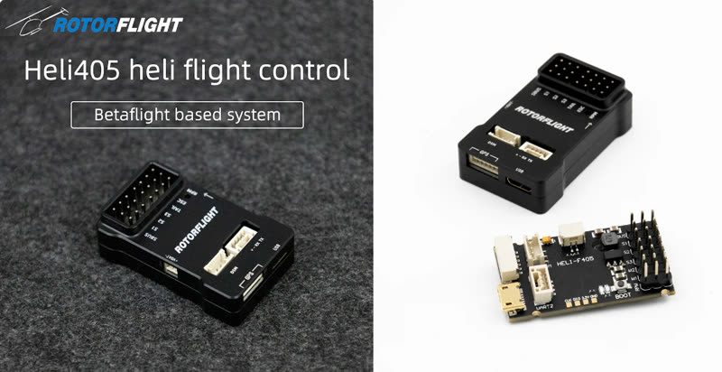
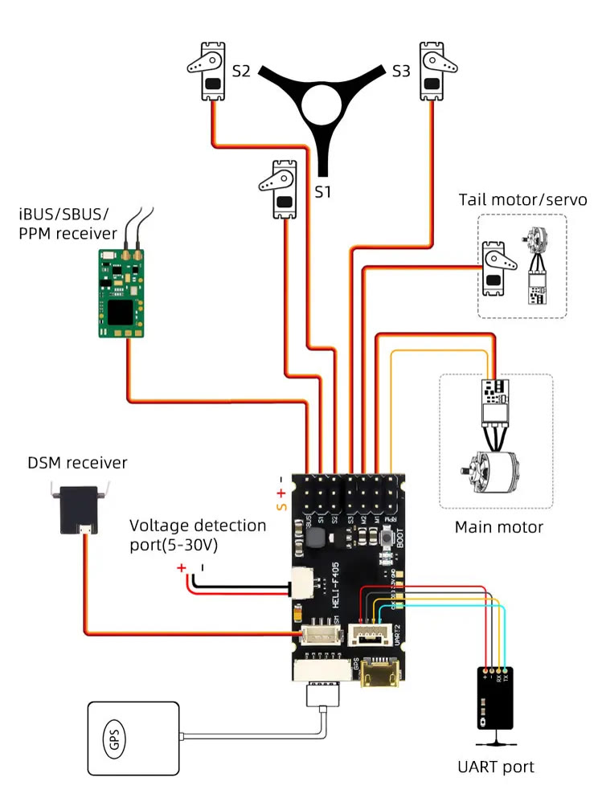

# Flywing HELI405

| | |
| --- | --- |
| **Board** | `FLYWING_HELI405` for a servo tail; `FLYWING_HELI405M` for a motorised tail |
| MCU | STM32F405RGT6 |
| Gyro | ICM-42688 |
| Blackbox | 16 MB |
| Barometer | SPL06 |
| Servo outputs | CH1-CH4 |
| RPM input | RPM (ESC RPM wire) |
| UARTs | UART1 GPS connector; UART2 top JST-GH port and SBUS; UART6 DSM |
| Voltage input | VBat 5-30 V |
| BEC input | 5-19 V |
| USB | Micro USB |
| Size, weight | 42 × 22 × 14 mm, 17 g |

Pick the board for your tail type when flashing: the `M` version has the
tail output set up as a motor.

## Wiring

The main connector carries SBUS, S1-S3, TAIL, ESC and RPM. The DSM
connector (UART6) is receive-only, for a Spektrum satellite.

As an F405, the HELI405 can't invert or pin-swap its UARTs in software --
see [Receiver](../configurator/tabs/receiver.md#signaling).

To use the SBUS pin for an LED strip, see
[LED Strip](../setup/led-strip.md#board-snippets).
