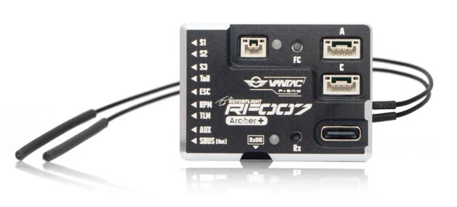
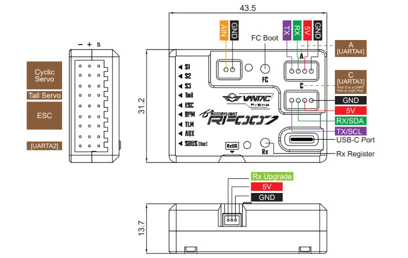

# FrSky VANTAC RF007

A Rotorflight flight controller with a built-in FrSky F.Bus receiver --
**RF007 Archer+** (Archer Plus RS) or **RF007 TWIN** (dual 2.4 GHz TW R6).

| | |
| --- | --- |
| **Board** | `VANTAC_RF007` |
| MCU | STM32F722RET6 |
| Gyro | ICM-42688-P |
| Blackbox | 128 MB flash |
| Barometer | SPL06-001 |
| Servo outputs | S1, S2, S3, Tail |
| Motor / RPM | ESC, RPM, TLM (ESC telemetry) |
| Other | AUX, SBUS out/in; expansion ports A and C; RxUG (receiver firmware update) |
| Supply | 5-16 V; 125 mA at 5 V (FC only) |
| Voltage input (AIN) | 0-80 V |
| Size, weight | 43.5 × 31.2 × 13.7 mm, 25.2 g |

## Wiring

| Label | Pin | Default function |
| --- | --- | --- |
| RPM | A02 | Frequency input |
| TLM | A03 | ESC telemetry (UART2 RX) |
| AUX | B06 | UART1 TX |
| SBUS out | B07 | UART1 RX |
| Port A | A00 / A01 | UART4 TX / RX |
| Port C | B10 / B11 | UART3 TX / RX |

The ports are labelled with their board names in the Configurator.

!!! note "RxUG port"
    The RxUG port is only for updating the built-in receiver's firmware if
    an over-the-air update fails. When powering the board through it, don't
    connect any other power.

To use the SBUS pin for an LED strip, see [LED Strip](../setup/led-strip.md#board-snippets).

## Manuals

[FrSky RF007 manual](https://www.frsky-rc.com/wp-content/uploads/Downloads/Amanual/VANTAC%20RF007%20Manual.pdf)
