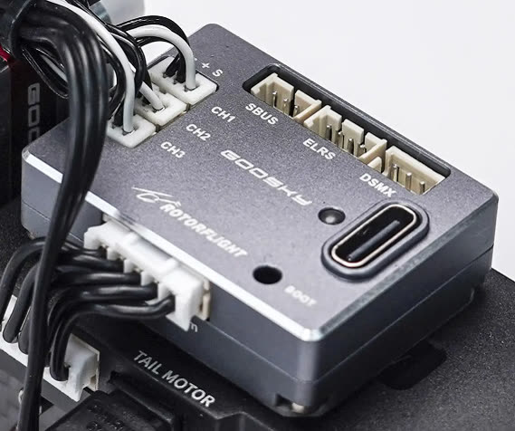

# GooSky F4 Mini

{ width="480" }

A small Rotorflight flight controller, and a drop-in replacement for the
stock flight controller in the GooSky S2 Max and S2 Ultra.

| | |
| --- | --- |
| **Board** | `GOOSKY_F4MINI` |
| MCU | STM32F405 |
| Gyro | ICM-42688-P |
| Blackbox | 128 MB flash (W25N01G) |
| Servo outputs | 3 (1.25 mm micro JST, Molex PicoBlade compatible) |
| UARTs | UART1 (ELRS / DSMX), UART2 (SBUS), UART5 (ESC telemetry) |
| Connectors | 3-pin SBUS, 4-pin ELRS (1.25 mm), 3-pin DSMX (JST-ZH), 5-pin ESC (JST-PH: power, telemetry, main and tail motor) |
| Supply | 5-16 V |
| Size, weight | 24 × 33 × 9 mm, 12 g |

It pairs with the **GooSky 3S F421 2-in-1 ESC**: two AT32F421 ESCs running
AM32, with bidirectional DShot RPM for both motors and BLHeli32-format
telemetry (voltage, current, temperature).

## Setting up an S2 Max or S2 Ultra

### 1. Flash the F4 Mini

[Flash](../getting-started/flashing-the-firmware.md) the latest release
with the `GOOSKY_F4MINI` board and **Full chip erase**.

### 2. Configure

Look for an S2 preset on the [Presets](../configurator/tabs/presets.md) tab,
or set up the helicopter with the [Setup Guides](../setup/index.md). Then:

1. [Calibrate the accelerometer](../configurator/tabs/setup.md#calibrate-accelerometer).
2. [Centre the servos](../setup/servos.md#3-centre-the-arms).
3. Check the [collective trim and zero pitch](../setup/mixer.md#2-level-the-swashplate-and-zero-the-pitch).
4. Set up [rates](../configurator/tabs/rates.md), [modes](../configurator/tabs/modes.md)
   and [adjustments](../configurator/tabs/adjustments.md) for your radio.

!!! note "The Rotorflight 2.2 S2 tune"
    The team's S2 tune (headspeeds 4400 / 5100 / 5500 rpm) was made for
    Rotorflight 2.2: [f4mini-s2-diff.txt](files/f4mini-s2-diff.txt). Use it
    for reference rather than loading it onto 2.3 or later, where the
    governor and rates have changed -- see the
    [Upgrade Notes](../getting-started/upgrade-notes.md).

### 3. Update the ESC firmware

!!! warning
    Follow this carefully. A failed flash can leave the ESC needing special
    tools to recover.

1. Download the latest `AM32_GOOSKY_3S_F421_<version>.hex` from the
   [AM32 releases](https://github.com/am32-firmware/AM32/releases).
2. Power up the S2 and connect the F4 Mini by USB. Make sure the
   Rotorflight Configurator isn't connected.
3. Open [am32.ca/configurator](https://am32.ca/configurator), click
   **Connect**, then **Read**.
4. **Flash firmware** → **Local** tab. The first time, tick **Ignore current
   MCU layout**. Choose the hex file and **Start flash**.

### 4. Configure the ESCs

ESC 1 drives the main motor, ESC 2 the tail. They need slightly different
settings -- the main ESC mustn't brake on spool-down, while the tail ESC
uses complementary PWM.

1. In the AM32 Configurator, **Apply config** with
   [s2-main-esc-config.bin](files/s2-main-esc-config.bin), with **only ESC 1**
   selected.
2. **Apply config** with
   [s2-tail-esc-config.bin](files/s2-tail-esc-config.bin), with **only ESC 2**
   selected.
3. **Disconnect** and power down.

In 2.4, the [ESC Programming](../configurator/tabs/esc-programming.md) tab
can also change AM32 settings per ESC.

!!! note "Editing the tail ESC in the AM32 Configurator"
    The AM32 Configurator shows ESC 1's settings even when only ESC 2 is
    selected. To edit the tail ESC there, temporarily expose only the tail
    ESC from the Rotorflight CLI:

    ```
    resource MOTOR 1 A08
    resource MOTOR 2 NONE
    save
    ```

    and afterwards restore:

    ```
    resource MOTOR 1 C08
    resource MOTOR 2 A08
    save
    ```

Check everything carefully, then go and fly.
