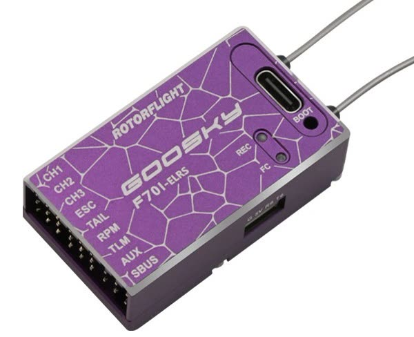

# GooSky F701-ELRS

{ width="480" }

A Rotorflight flight controller with a built-in ExpressLRS receiver.

| | |
| --- | --- |
| **Board** | `GOOSKY_F701` |
| MCU | STM32F722RET6 |
| Gyro | ICM-42688-P |
| Blackbox | 256 MB flash |
| Barometer | SPL06 |
| Servo outputs | CH1, CH2, CH3, TAIL |
| Motor / RPM | ESC; RPM (dedicated frequency input); motorised tail supported |
| Built-in receiver | ExpressLRS, on UART1 |
| Other ports | TLM (UART5 RX -- ESC telemetry), AUX (UART4 TX), SBUS (UART2 RX) |
| Supply | 5-16 V; port power 5 V, 1.5 A |
| Size, weight | 46 × 26 × 14.5 mm, 22 g |
