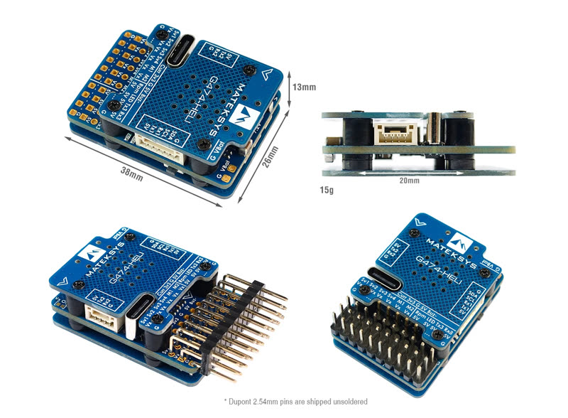
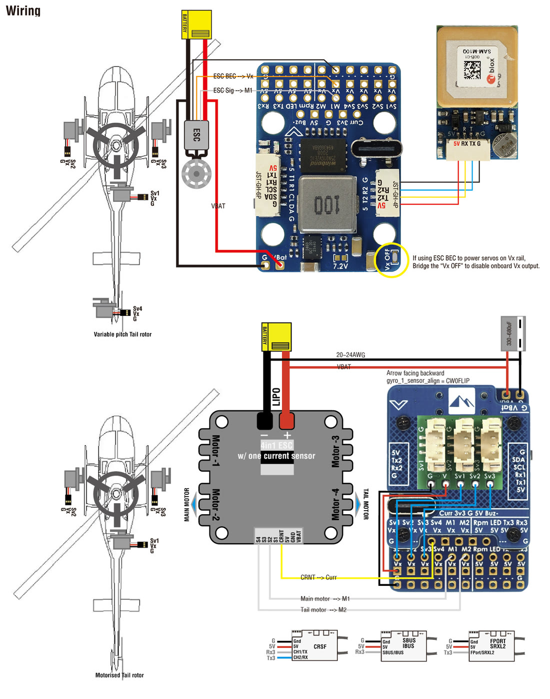
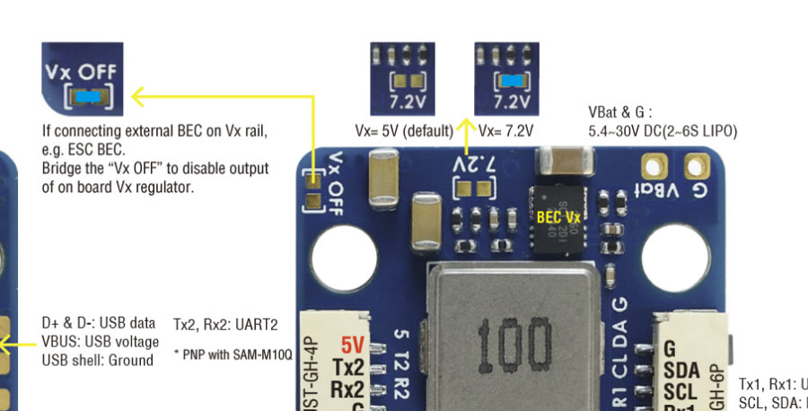
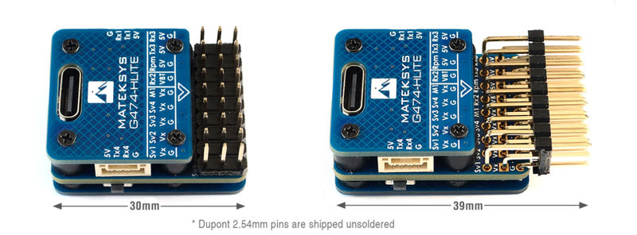
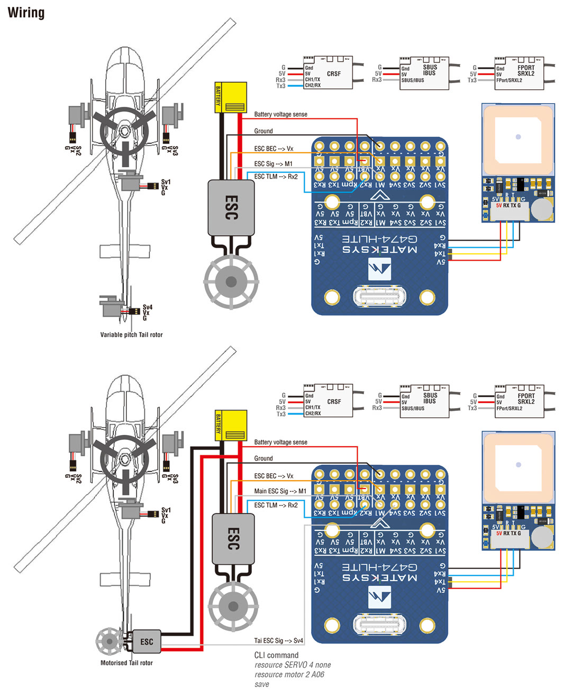

# Matek G474-HELI and G474-HLITE

Both use the `MATEKG474HELI` board when flashing.

## G474-HELI



| | |
| --- | --- |
| **Board** | `MATEKG474HELI` |
| MCU | STM32G474CE |
| Gyro | ICM-42688-P |
| Blackbox | 128 MB flash (W25N01G) |
| Barometer | SPL06 |
| Servo outputs | CH1-CH4 |
| Motor outputs | M1, M2 |
| RPM input | Frequency input |
| UARTs | UART1, UART2, UART3, UART4 |
| Other | LED strip, buzzer, USB-C |
| Battery input | VBat 2-6S (5.4-30 V) |
| Onboard BEC | 5 V or 7.2 V selectable, 5 A (8 A peak) |
| Size, weight | 38 × 26 × 13 mm, 15 g |



### Onboard BEC

The servo BEC is powered from VBat and gives 5 V by default, or 7.2 V with
its solder bridge closed.

{ width="480" }

!!! warning "External BEC"
    If you power the servos from an external BEC, the onboard BEC **must** be
    disabled with the **Vx Off** solder bridge.

[Matek G474-HELI product page](https://www.mateksys.com/?portfolio=g474-heli)

## G474-HLITE



A smaller version without the onboard BEC.

| | |
| --- | --- |
| **Board** | `MATEKG474HELI` |
| MCU, gyro, blackbox, baro | As the G474-HELI |
| Servo outputs | CH1-CH4 |
| Motor output | M1 |
| UARTs | UART1, UART2 (RX only), UART3, UART4 |
| Vx input | 4.5-14 V |
| Size, weight | 30 × 23 × 13 mm, 9 g |



### Motorised tail

The HLITE has one motor output. For a motorised tail, turn servo 4 into
motor 2:

```
resource SERVO 4 NONE
resource MOTOR 2 A06
save
```

[Matek G474-HLITE product page](https://www.mateksys.com/?portfolio=g474-hlite)
