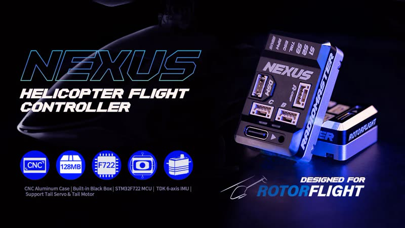
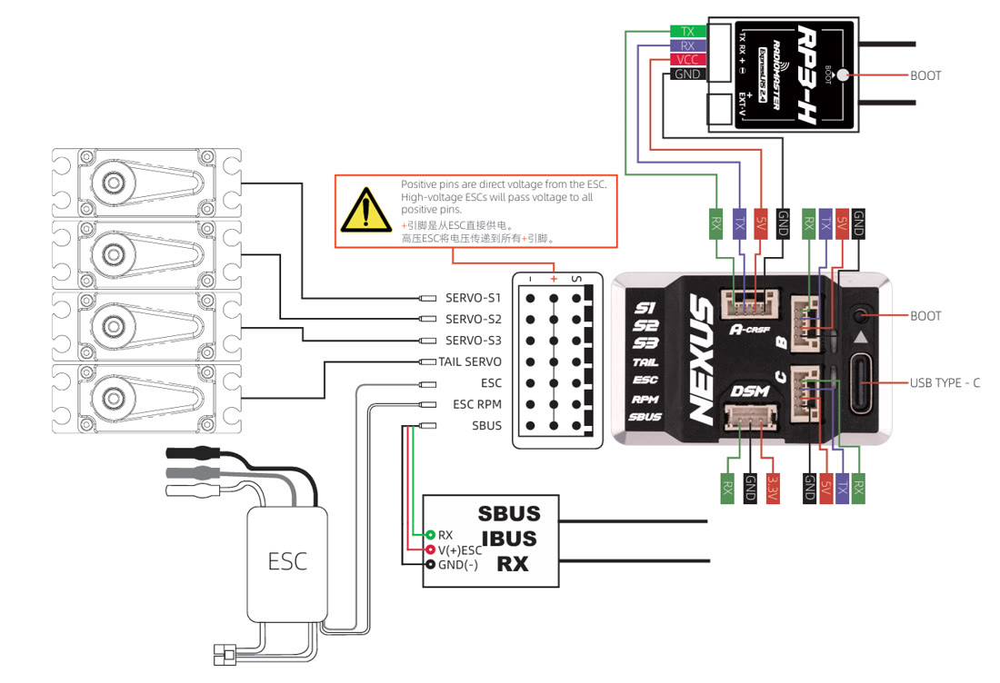

# Radiomaster Nexus



<iframe width="100%" style="aspect-ratio: 16/9" src="https://www.youtube.com/embed/G9lQ2TzKDRA" title="Radiomaster Nexus" frameborder="0" allow="accelerometer; clipboard-write; encrypted-media; gyroscope; picture-in-picture" allowfullscreen></iframe>

| | |
| --- | --- |
| **Board** | `NEXUS_F7` |
| MCU | STM32F722RET6 |
| Gyro | ICM-42688-P |
| Blackbox | 128 MB flash |
| Barometer | SPL06-001 |
| Servo outputs | S1, S2, S3, TAIL |
| Motor output | ESC; tail motor supported |
| RPM input | RPM (from the ESC or a sensor) |
| UARTs | DSM (UART1), S.BUS (UART2), A-CRSF (UART4), Port B (UART6), Port C (UART3) |
| Supply | 5-12.6 V |
| Port power | Ports A, B, C: 5 V, 2 A. DSM: 3.3 V, 0.5 A |
| Size, weight | 41.3 × 25.4 × 13.1 mm, 16.8 g |

## Wiring



!!! warning "Servo rail voltage"
    The **+** pins on the servo header carry the ESC's BEC voltage directly.
    A high-voltage BEC puts that voltage on every **+** pin -- make sure
    everything plugged in can take it.

Port **A** is set up for an ExpressLRS/CRSF receiver; Radiomaster's RP3-H
plugs straight in. The ports are labelled in the Configurator with their
board names (*Port A*, *S.BUS*, *DSM*...), so pick the function for each
on the [Configuration](../configurator/tabs/configuration.md#serial-ports)
tab.

**F.Port** works on the TX pin of Port A, B or C, with *Inverted* and
*Half-Duplex* on in the [Receiver](../configurator/tabs/receiver.md) tab.

## Motorised tail

Turn the TAIL servo output into a tail motor output:

```
resource SERVO 4 NONE
resource MOTOR 2 B03
save
```

Or use the [Remap FC](../configurator/tabs/remap-fc.md) tab (2.4).

## Nexus X and Nexus XR

The **Nexus X** (`NEXUS_X`) and **Nexus XR** (`NEXUS_XR`) are the
second-generation Nexus, with the servo header in the order S1, S2, S3,
TAIL, ESC, RPM, TLM, AUX, SBUS. The **XR** adds a built-in ExpressLRS
receiver, on UART5.

Motorised tail on the X and XR:

```
resource SERVO 4 NONE
resource MOTOR 2 A15
save
```

## Manuals

[Radiomaster Nexus product page](https://www.radiomasterrc.com/products/nexus-helicopter-flight-controller)
