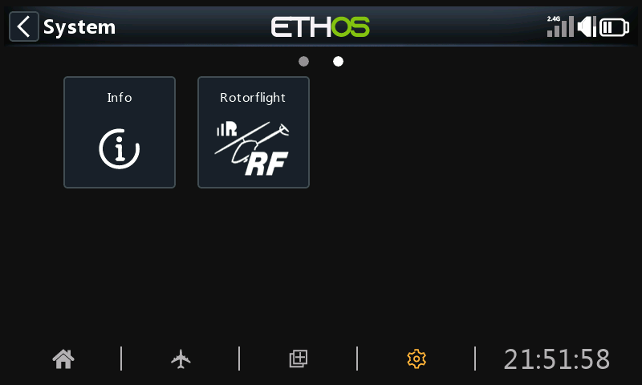

# FrSky Ethos

**RFSuite for Ethos** is Rotorflight's Lua suite for FrSky radios. It
adds:

- a **configuration tool** in the System menu, with touch pages for
  almost everything the Configurator does -- tuning, governor, mixer,
  servos, power, ESC programming;
- a **dashboard widget** that shows the helicopter's state, headspeed, fuel
  and voltage, changing layout before, during and after the flight;
- **voice announcements** for arming, profiles, adjustments and fuel;
- **flight logs**, and an **ActiveLook** glasses widget.

!!! tip "Try it without a radio"
    The [RFSuite web simulator](https://ethos.studio1247.com/nightly16/X20PRO_FCC?backup=https://github.com/rotorflight/rotorflight-lua-ethos-suite/raw/refs/heads/master/demo/DEMO.zip&reset=all&language=en)
    runs the suite in your browser, against a simulated helicopter.

## Requirements

- **Ethos 1.6.2 or later**, on an X10, X12, X14, X18, X20 or Twin X Lite.
- A receiver with telemetry:
    - FrSky ACCESS, ACCST, TD or TW receivers on **S.Port**, **F.Port** or
      **F.Bus** -- for example Archer, TD MX, TW MX, R-XSR, RX6R;
    - or **ExpressLRS**, through an Ethos-supported ELRS module.
- Rotorflight firmware from the same release as the suite.

## Installing

=== "Updater (recommended)"

    1. Download the [RFSuite Updater](https://github.com/rotorflight/rotorflight-lua-ethos-suite-updater/releases)
       for Windows, macOS or Linux.
    2. Connect the radio to the computer by USB.
    3. Run the updater, choose the release and language, and install.

=== "Ethos Suite"

    1. Download the zip for your language from the
       [RFSuite releases](https://github.com/rotorflight/rotorflight-lua-ethos-suite/releases/latest).
    2. Connect the radio to FrSky's Ethos Suite, open **Lua Development
       Tools**, choose **Install Lua Scripts**, select the zip and install
       `rfsuite`.

Restart the radio afterwards.

## First start

1. Set up the radio model and telemetry -- see [Radio Setup](radio-setup.md).
2. Make sure the **Rotorflight [Background]** task is running: in the
   model's **Lua** page, enable it. The dashboard shows *Background task
   not running* if it isn't.
3. Power up the helicopter, then press **SYS**, go to the second page and
   open **Rotorflight**.

{ width="480" }

Then see [Using RFSuite](lua-suite.md).

## Reference

Every RFSuite page is documented, setting by setting, in the
[RFSuite page reference](https://github.com/rotorflight/rotorflight-lua-ethos-suite/blob/master/docs/pages/README.md).
