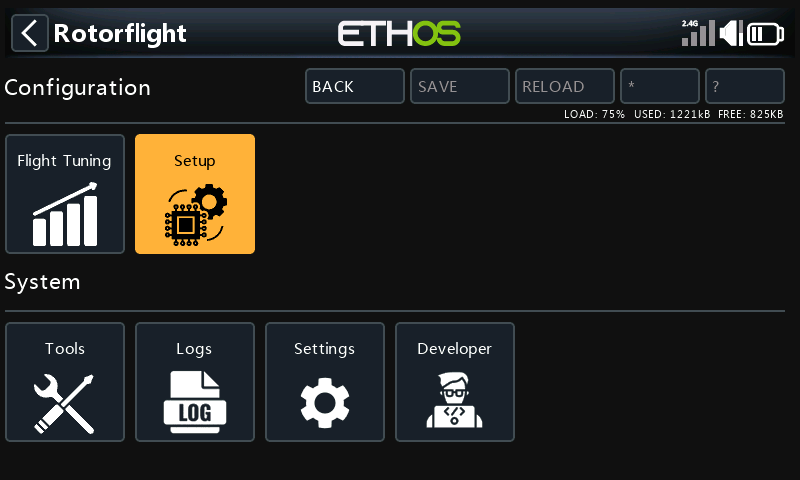
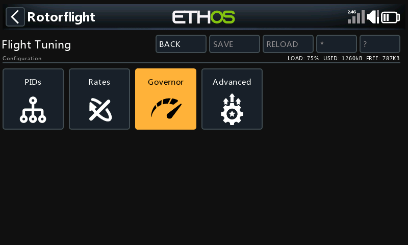
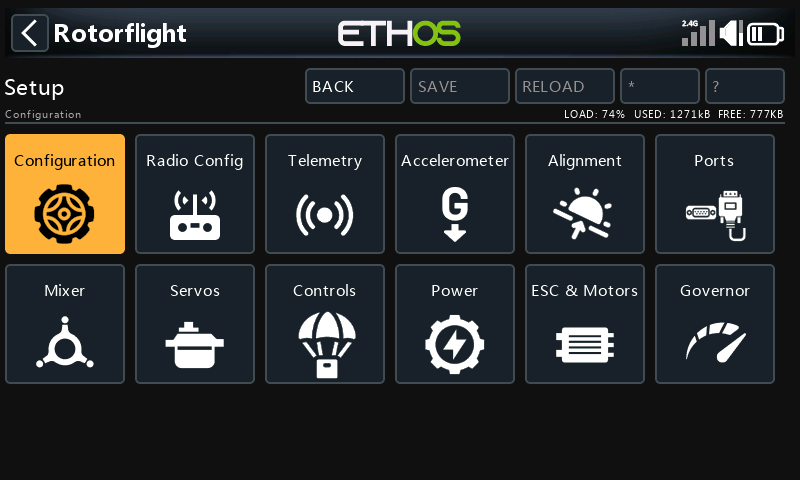
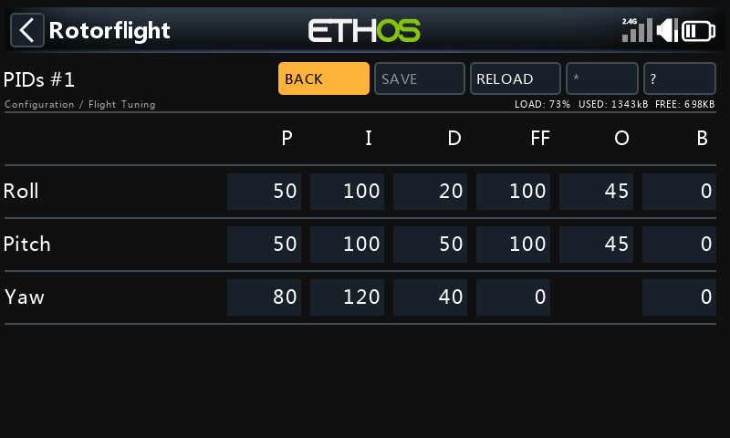
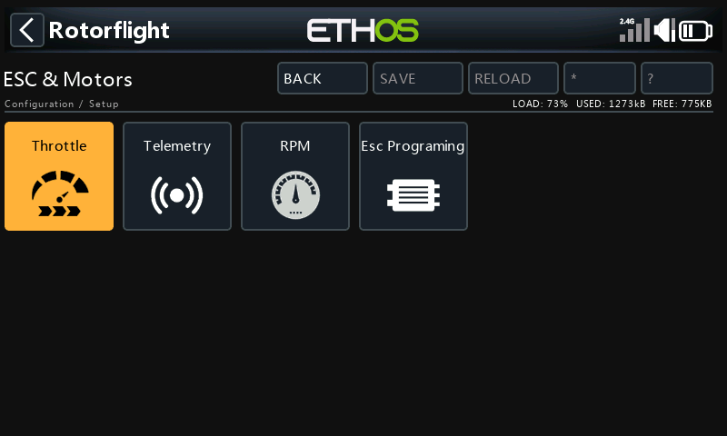
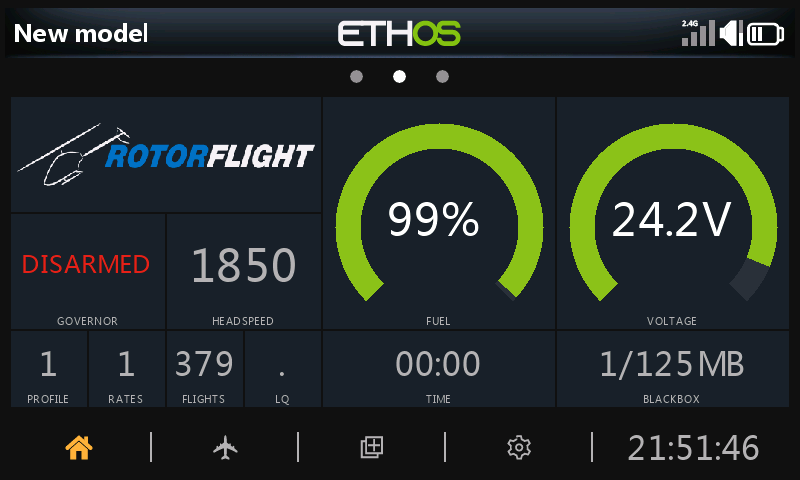
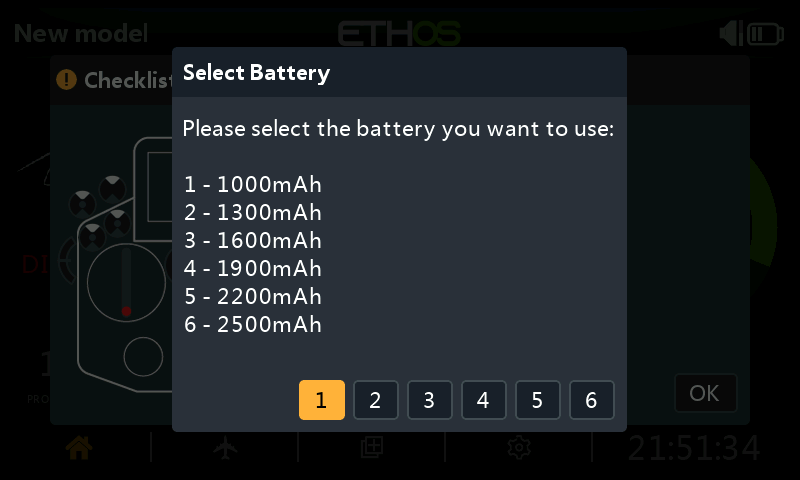

# Using RFSuite on Ethos

## The configuration tool

Press **SYS**, go to the second page and open **Rotorflight**. The suite
connects to the flight controller over telemetry; once it answers, the
menus are enabled.

{ width="560" }

| Menu | Holds |
| --- | --- |
| **Flight Tuning** | PIDs, Rates, Governor (per profile) and Advanced: filters, PID controller, bandwidth, autolevel, main and tail rotor, rescue, rate tables. The [Tune Advisor](tune-advisor.md) gives tuning hints from your recent flights and can write them to the flight controller. |
| **Setup** | Configuration, Radio Config, Telemetry, Accelerometer, Alignment, Ports, Mixer, Servos, Controls (modes, adjustments, failsafe, beepers, Blackbox), Power, ESC & Motors, Governor. |
| **Tools** | Profile copy and selection; diagnostics -- status, ELRS link, info. |
| **Logs** | Flight logs recorded by the radio. |
| **Settings** | Suite settings: dashboard theme, audio announcements, ActiveLook, language. |

### Editing and saving

{ width="560" }

Each page has the same buttons at the top:

| Button | |
| --- | --- |
| **Back** | Back to the menu. |
| **Save** | Writes the page to the flight controller and saves it permanently. Nothing changes until you save. |
| **Reload** | Reads the page from the flight controller again, discarding your edits. |
| **\*** | Page-specific actions, where a page has them. |
| **?** | Help for the page, including tuning tips. |

Pages that depend on the profile -- PIDs, rates, governor -- show the
profile number in their title, e.g. *PIDs #1*, and edit the profile that's
currently active.

While the helicopter is **armed**, pages are read-only: nothing can be
written in flight.

### ESC programming

**Setup → ESC & Motors → ESC Prog.** programs the ESC through the
flight controller. The entry for your ESC lights up when the flight
controller reports its ESC telemetry protocol. See
[ESC Forward Programming](../../setup/esc-programming.md).

{ width="560" }

## The dashboard

Add the **Rotorflight Dashboard** widget to a full-screen page: press
**DISP**, add a screen with the full-screen layout, and choose the widget.

{ width="560" }

It shows the arming and governor state, headspeed, fuel and voltage,
profiles, flight count, timer and Blackbox use, with separate layouts for
before, during and after the flight. Themes are chosen under **Settings →
Dashboard**.

- **Slide up** (or long-press PAGE) for the toolbar: reset the flight,
  erase the Blackbox, choose the battery profile, open the info panel, or
  open the configuration tool.
- **Slide down** for the info panel: link quality, firmware, flight
  controller status and more.
- A **status banner** appears for conditions such as failsafe, governor
  fallback, an override left on, or a reboot needed.

### Battery selection

With more than one [battery profile](../../configurator/tabs/power.md#battery-profiles)
set up, the suite asks which pack you've plugged in when the helicopter
connects:

{ width="480" }

## Voice announcements

Under **Settings → Audio**, choose what's announced: arming and disarming,
governor state, profile and rate changes, adjustments, battery and fuel
levels, and timers -- and which switches trigger on-demand callouts.

## Reference

Every page and setting is documented in the
[RFSuite page reference](https://github.com/rotorflight/rotorflight-lua-ethos-suite/blob/master/docs/pages/README.md).
