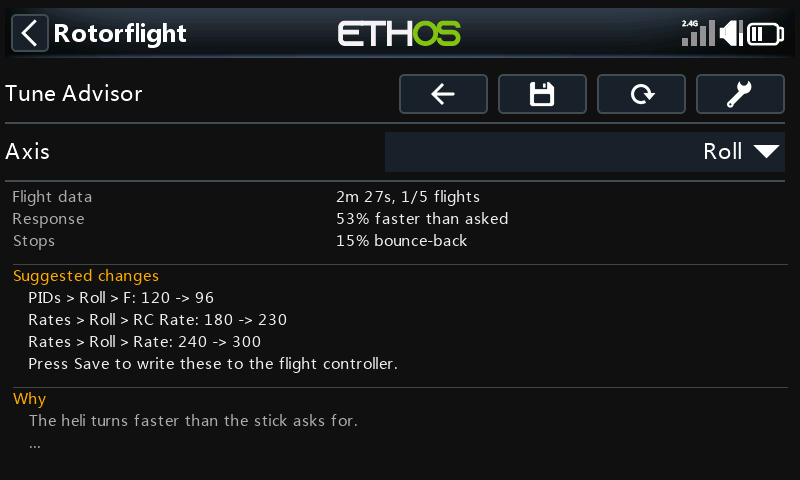
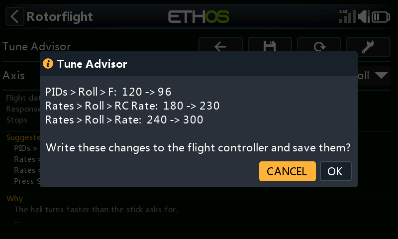

# Tune Advisor

The Tune Advisor tells you how your heli answers the sticks and what to change next. While you fly in rate
mode, the flight controller measures each axis. Each time you disarm, the radio saves those measurements. The
page combines your last few flights and suggests one change at a time for each axis. **Save** can write that
change to the flight controller for you.

**Flight Tuning → Tune Advisor**

{ width="560" }

The flight controller needs firmware with the Tune Advisor. Older firmware shows *Needs newer firmware*. The
radio's background task must be running, and the heli must have been connected since the page opened. After
that, the saved flights stay on screen through a link loss.

## Collecting flight data

The flight controller counts only rate flight while spooled up and airborne, with the heli moving on some axis.
Time in Angle, Horizon, Trainer, Altitude hold, Rescue, GPS rescue or failsafe is left out.

What it needs:

- **Response** needs about ten seconds of stick inputs between 40 and 200 deg/s on that axis. *Needs more flying*
  shows how far along it is.
- **Stops** needs 10 stick releases: move the stick, then let it come back to centre. Centre the stick after each
  input instead of reversing straight through.

One flight may be enough, or it may take a few. Fly your normal rate-mode flying with clear inputs and releases
on each axis.

## How flights are saved and combined

Each time you disarm, the radio's background task reads the measurements for roll, pitch and yaw from the flight
controller. It saves them as one flight and then clears them on the flight controller, so the next flight is
measured on its own. This happens whether or not the Tune Advisor page is open.

- The flights are kept on the radio's SD card in `LOGS:/rfsuite/tune/<model>/history.csv`, one row per axis per
  flight. `<model>` is the flight controller's ID, the same one that names the flight log folders.
- Only the **last 5 flights** are kept.
- A flight with no rate flight in it is not saved.
- If you disarm while the radio has lost the link, the flight is saved when it reconnects. That works as long as
  the flight controller has not been powered off in between.

The page combines the flights like this:

1. It starts from the **newest** flight and works backwards, up to 5 flights.
2. It only combines flights flown on **the same tune** as the newest one: the same P, F, B, Iterm Relax Cutoff,
   rate type and rates on that axis. It stops at the first older flight with a different tune. Advice worked out
   from flights on an old tune would be advice for settings you no longer fly.
3. Counts add up: seconds of data, stick releases, full-stick moments.
4. Each measurement is averaged across the flights, weighted by how much data it came from. A long flight counts
   for more than a short one.

The flight controller weights its own response figure slightly differently inside a flight, so the combined
response is a close estimate rather than an exact one. The stop figures combine exactly. Each axis is combined
on its own.

*Flight data* on the page shows how much was combined, for example *2m 27s, 1/5 flights*.

## What it suggests

The flight controller only measures. The advice is worked out on the radio, so it can be improved without a
firmware update.

- **Turns faster or slower than asked** (more than 15% off): change F and the rates by the same amount in
  opposite directions. The stick feel stays the same, but the heli now flies the rate you ask for. One step
  changes F by at most 20%. An axis with F set to 0 (often the tail) gets no F advice.
- **Full stick asks for more rate than the heli reaches** (roll and pitch), with the cyclic at its limit: lower
  the rates to what the heli reaches.
- **Stops bounce back 12% or more:**
  - If the I-term pushes the heli back after the stop, lower *PID Controller > Iterm Relax Cutoff* by 20%.
  - If F does not match yet, fix F first and check again.
  - Otherwise the controller is barely braking the stop: raise P by 20% (or add B).
- **Turns faster at high |collective| than at low** (or the reverse) by 25% or more is shown as a fact, with no
  change.

With Actual, Quick and Rotorflight rates the page gives the exact rate values. With Betaflight, Raceflight and
KISS rates the curve cannot be scaled exactly, so it gives a percentage.

## Applying the changes

Press **Save** to write the suggested changes for the axis on screen. It is greyed out unless the heli is
connected and disarmed and there is a change it can write. It applies **one axis at a time**: switch *Axis* and
press **Save** again for another axis.

{ width="560" }

**Save** first lists exactly what it will change and asks you to confirm (*Cancel* is selected). It then shows
each step as it runs:

1. **Reading current settings**: reads PIDs, PID Controller and Rates from the flight controller. If a read
   fails, or a reply comes back short, it stops and nothing is changed.
2. It checks that the flight controller still holds the tune the flights were flown with: the same PID and rate
   profile, and the same P, F, B, Iterm Relax Cutoff, rate type and rates on that axis. If anything differs it
   stops, and nothing is changed. That happens if you changed a setting by hand, switched profile, or already
   applied this advice. It also stops if a new value is out of range or the heli has been armed.
3. **Writing changes**: only the advised settings change. Everything else is written back exactly as it was read.
4. **Saving to flight controller**: makes the change permanent.
5. **Checking saved settings**: reads the settings back to confirm the new values.

With Betaflight, Raceflight or KISS rates, **Save** does not write the percentage rate change. It does not write
the F change that goes with it either, because F on its own would change the stick feel. Make both by hand, or
use Actual, Quick or Rotorflight rates.

| Message | What happened |
| --- | --- |
| Could not read the settings… | A read failed. Nothing was changed. |
| The settings on the flight controller are not the ones these flights were flown with… | The tune differs from the flights'. Nothing was changed. Fly again on the current settings. |
| Disarm first… | The heli was armed. Nothing was saved. |
| Writing failed… | Part of the change may have been sent but none of it was saved. Restarting the flight controller undoes it. |
| Saving failed… | The change is active but not saved. It is undone when the flight controller restarts. |
| Saved, but reading back did not confirm it… | Check the values on *PIDs*, *Rates* and *PID Controller*. |

### After applying

The saved flights are **not** erased. Your next flight is on the new tune, so the page starts again from it and
leaves the older flights out of the advice. The flight controller also starts its measurements afresh when it
arms on a changed tune. You do not need to clear anything.

Every change **Save** writes is added to `changes.csv` beside the flight history: date, axis, setting, old value,
new value (raw values, as the flight controller stores them). It is your record of what the advisor changed, so
you can always set a value back by hand. Clearing the flights does not erase it.

## Adjustment functions

[Adjustments](../../configurator/tabs/adjustments.md) let you change settings from a switch or knob while flying.
Several of them change exactly what the Tune Advisor measures and writes: P, F, B, the rates and Iterm Relax
Cutoff per axis, and the PID and rate profile. The firmware applies an adjustment straight away and saves it when
you disarm.

- **Adjusting during a flight mixes two tunes.** The flight controller checks the tune only when you arm. A
  flight where you adjusted one of these settings, or switched profile, is measured partly on the old value. It is
  then saved as if it had all been flown on the value you ended on. Leave these adjustments alone while you
  collect flights for the advisor. If you did use one, clear the flights and fly again.
- **Adjusting between flights is fine.** A *Stepped* adjustment is saved at disarm, so the next flight is on a new
  tune and the advisor starts again from it, just as it does after **Save**.
- **A *Mapped* adjustment overrides Save.** It sets the value from the knob's position: as soon as the knob moves,
  and at every power-up while the adjustment is enabled. A value written by **Save** only lasts until then. Before
  applying advice to a setting that has a *Mapped* adjustment, set that adjustment's *Type* to *Off*, or leave the
  knob where it gives the new value.
- A *Mapped* profile switch is fine between flights. Flights are only combined when their tune values match, so
  the advice follows the profile you fly. Two profiles with identical values on an axis count as the same tune
  for that axis.
- **Save** checks the profiles and values at the moment it writes. An adjustment or profile switch made since the
  flights makes it stop with nothing changed.

## Clearing the data

The page's **\*** button erases this model's saved flights and the flight controller's current measurements,
after asking. Use it when the saved flights no longer describe the heli, for example after a repair, new blades
or a head change, or after an in-flight adjustment.

## See also

- [Profiles: PID Controller Gains](../../configurator/tabs/profiles.md#pid-controller-gains) and
  [PID Controller Settings](../../configurator/tabs/profiles.md#pid-controller-settings).
- [Rates](../../configurator/tabs/rates.md#rates).
- [Adjustments: Mapped and Stepped](../../configurator/tabs/adjustments.md#mapped-and-stepped).
