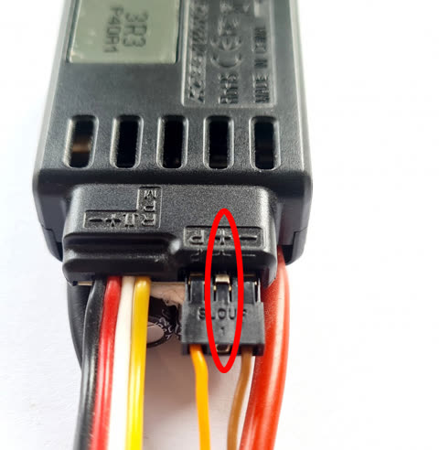
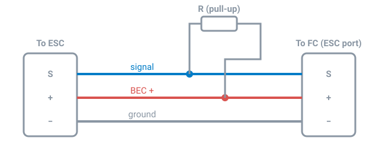

# ESC Telemetry

Most helicopter ESCs can report what they're doing: RPM, voltage, current,
mAh used, temperatures, and more. Connect the ESC's telemetry wire to the
flight controller and Rotorflight can use these readings for the battery
meter and SmartFuel, log them to Blackbox, and pass them on to your radio.

!!! note "ESC telemetry is not an RPM source for the governor"
    Serial ESC telemetry updates too slowly for the governor or the RPM
    filter. Use the ESC's RPM output or an RPM sensor, or bidirectional
    DShot -- see [RPM Measurement](rpm-measurement.md).

## Supported ESCs

| Telemetry Protocol | ESCs |
| --- | --- |
| **BLHELI32** | BLHeli_32 and KISS ESCs |
| **HOBBYWINGV4** | Hobbywing Platinum Pro V4 / V4.1, FlyFun V5 |
| **HOBBYWINGV5** | Hobbywing Platinum V5 |
| **SCORPION** | Scorpion (unsolicited telemetry) |
| **KONTRONIK** | Kontronik Kosmik and Kolibri |
| **OMPHOBBY** | OMPHobby |
| **ZTW** | ZTW Skyhawk |
| **APD** | APD HV Pro (UART telemetry) |
| **OPENYGE** | YGE (firmware V1.03547 or later) |
| **FLYROTOR** | FlyRotor |
| **GRAUPNER** | Graupner |
| **XDFLY** | XDFly |
| **FBUS** | FrSky ESCs and sensors on F.Bus |
| **SRXL2** | Spektrum SRXL2 ESCs *(new in 2.4)* |
| **CASTLE** (motor protocol) | Castle Creations, Live Link -- see [below](#castle-creations) |

## Setting it up

1. **Wire it.** Connect the ESC's telemetry *output* to a free UART **RX**
   pad on the flight controller, plus ground. Never connect the telemetry
   lead's **+** pin -- on some ESCs it carries the BEC voltage, which would
   damage the flight controller.

    { width="320" }

    If you want [forward programming](esc-programming.md) as well, the wire
    needs to be two-way: see that page for using the TX pad, or RX with pin
    swap.

2. **Choose the port.** On the [Configuration](../configurator/tabs/configuration.md#serial-ports)
   tab, set that UART to **ESC Telemetry**. Save and reboot.
3. **Choose the protocol.** On the [Motors](../configurator/tabs/motors.md#esc-telemetry)
   tab, set **Telemetry Protocol** to your ESC. Save.
4. **Power up together.** Many ESCs only start sending telemetry after a
   handshake at power-up. Power the flight controller and ESC at the same
   time, from the flight battery -- not USB first, then the battery.
5. **Check.** The Motors tab shows RPM, voltage, current and temperature
   from the ESC.

## Using it for the battery meter

On the [Power](../configurator/tabs/power.md#meters) tab, set **Battery
Voltage Source** and/or **Battery Current Source** to **ESC**. The ESC is
then your battery meter -- useful when the flight controller has no current
sensor of its own.

### Correcting the readings

Some ESCs' voltage and current readings are a few percent out. On the
Motors tab, **Sensor Correction** scales the **Voltage**, **Current** and
**Consumption** readings. Compare against a good meter (or the charger's
"mAh put back in") and adjust.

## Castle Creations

Castle ESCs send telemetry back on the throttle wire itself ("Live Link"),
so no extra UART is needed.

1. Enable **Link Live** on the ESC with the Castle Link software.
2. Add a pull-up resistor between the signal wire and the BEC + wire, on
   the lead between the ESC and the flight controller:

    

    The ESC has a 6.65 kΩ pull-down inside, so the resistor sets the signal
    voltage. **8.2 kΩ** works with BEC voltages of 5-11 V on a 5 V-tolerant
    pin, and up to 7.4 V on a 3.3 V-only pin. Common choices by BEC voltage:

    | BEC | Resistor |
    | --- | --- |
    | 5 V | 5 kΩ |
    | 7.4 V | 8.2 kΩ |
    | 9.6 V | 13 kΩ |
    | 12 V | 18 kΩ |

3. On the [Motors](../configurator/tabs/motors.md) tab, set **Throttle
   Protocol** to **CASTLE**, and leave the **Telemetry Protocol** off.
   Castle mode limits the throttle update rate to 100 Hz.

Some Castle ESCs don't report current.
