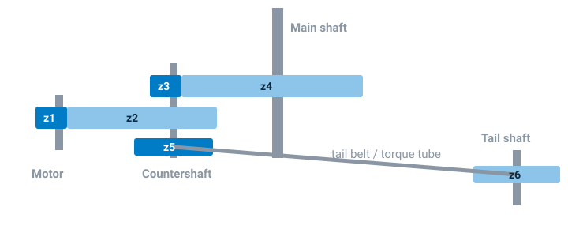
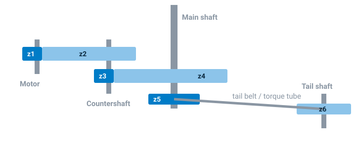

# Gear Ratios

The flight controller measures the *motor's* RPM and works out the main and
tail rotor speeds from the gear ratios. Accurate ratios matter: the
governor's headspeed and every RPM filter notch depend on them.

Most helicopters have a single-stage gearbox -- a motor pinion driving the
main gear -- and the ratios are simply tooth counts:

| Motors tab field | Enter |
| --- | --- |
| **Main Rotor Gear Ratio** | pinion teeth : main gear teeth, e.g. `12 : 120` |
| **Tail Rotor Gear Ratio** | tail gear (or tail pulley) teeth : the gear (or pulley) driving it, e.g. `22 : 99` |

Some larger helicopters have a **two-stage** gearbox, with a countershaft
between motor and main shaft. Then the ratio is the product of both stages.

## Two-stage gearboxes

### Type 1 -- tail driven from the countershaft

Used by many SAB and Align helicopters.

- Main Rotor Gear Ratio = **(z1 × z3) : (z2 × z4)**
- Tail Rotor Gear Ratio = **(z3 × z6) : (z4 × z5)**

The defaults are an SAB Goblin 700 with a 21T motor pinion: main
`378 : 3808`, tail `468 : 2312`.

### Type 2 -- tail driven from the main shaft

- Main Rotor Gear Ratio = **(z1 × z3) : (z2 × z4)**
- Tail Rotor Gear Ratio = **z6 : z5**

The defaults are a KDS Agile A5 with a 21T pinion: main `357 : 3564`, tail
`14 : 57`.

## Any other gearbox: count the turns

For anything else, or to check your numbers:

- **Tail ratio** -- mark a main blade grip and a tail blade grip, turn the
  main rotor exactly 10 turns by hand, and count the tail rotor turns. Enter
  `10 : <tail turns>`.
- **Main ratio** -- the same with the motor and main rotor, if you can see
  the motor turn. Or work it out stage by stage: multiply all the *driving*
  gears' teeth together for the first number, and all the *driven* gears'
  teeth together for the second.

Then compare the **Rotor Speed** shown on the Motors tab with an optical
tachometer.
