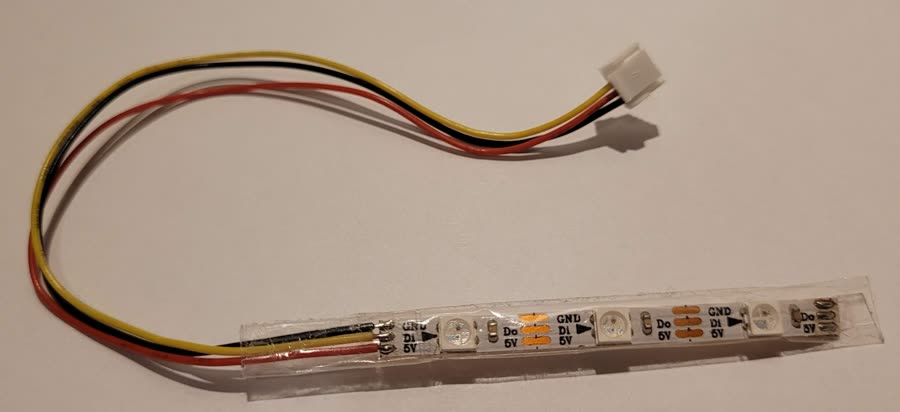
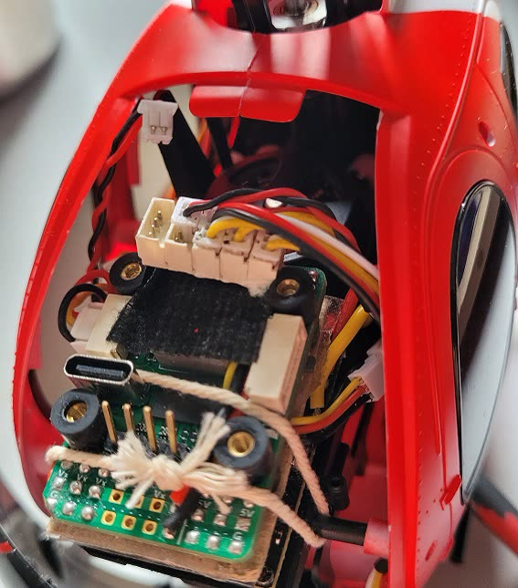
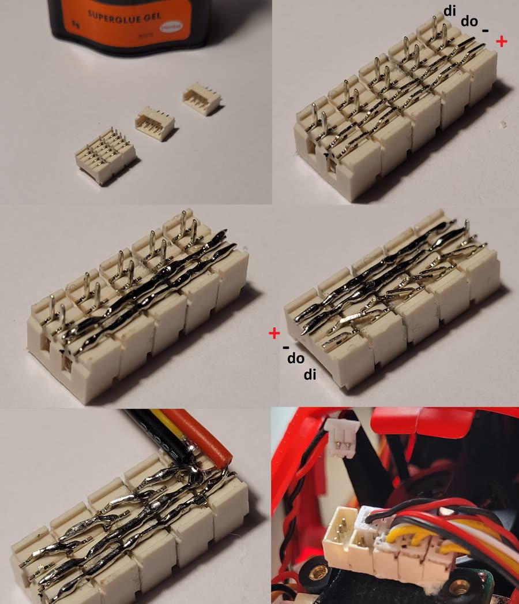

# LED Strip

Rotorflight drives up to 32 addressable WS2811/WS2812 LEDs from one data
pin. Each LED can have its own colour and function: orientation lights,
battery and arming warnings, or scale lighting -- navigation lights,
anti-collision beacons, strobes and landing lights.

This guide sets up three scale lights. The
[LED Strip](../configurator/tabs/led-strip.md) tab page explains every
option.

<iframe width="100%" style="aspect-ratio: 16/9" src="https://www.youtube.com/embed/GB6hGU9MKpI" title="LED strip quick start" frameborder="0" allow="accelerometer; clipboard-write; encrypted-media; gyroscope; picture-in-picture" allowfullscreen></iframe>

## Wiring

Each LED has four connections: **5 V**, **ground**, **data in** and **data
out**. The flight controller's LED pin goes to *data in* of the first LED;
its *data out* goes to *data in* of the next, and so on.

{ width="480" }

WS2812 strips (30, 60 or 144 LEDs per metre) are handy for testing and for
lighting a boom. Individual 5 mm and 8 mm WS2811 LEDs suit scale lighting.
With more than a few LEDs, power them from a separate 5 V supply.

## The LED pin

The flight controller needs a pin assigned to `LED_STRIP`, with a timer and
DMA. Some boards have one; on others, repurpose a pin -- with the
[Remap FC](../configurator/tabs/remap-fc.md) tab (2.4), or the CLI snippets
[below](#board-snippets).

Then turn on **LED_STRIP** under *Features* on the
[Configuration](../configurator/tabs/configuration.md#features) tab and
**Save and Reboot**. The LED Strip tab appears.

## Three scale lights

### Place the LEDs

1. On the LED Strip tab, switch to the wire-ordering mode.
2. Click three squares on the grid, in turn. They're numbered 0, 1, 2 -- the
   order they're wired in.
3. Give each the **Color** function. **Save**.

### LED 0 -- green navigation light with strobe

1. Select LED 0 and left-click **green** in the palette. It lights up.
2. Turn on **Blink** with one tick: the LED briefly goes dark once per cycle.
3. Right-click **white**: the dark moment becomes a white strobe flash.

If the LEDs are too bright, lower **Overall brightness** under *LED Strip
Global Settings*.

### LED 1 -- red anti-collision beacon

1. Select LED 1, turn on **Blink** and tick a few adjacent steps.
2. Right-click **red**. The LED flashes red.

### LED 2 -- landing light

1. Select LED 2, turn on **Fade to alt color**, and left-click **white**.
2. Set the *Profile* to **Status Alt**: the LED dims. With **Fade rate** at 10
   it fades slowly.
3. To switch it from the radio, add an [adjustment](../configurator/tabs/adjustments.md)
   with **LED Profile Selection** on a switch: one position for *Status*
   (light on), one for *Status Alt* (light off).

**Save**.

<iframe width="100%" style="aspect-ratio: 16/9" src="https://www.youtube.com/embed/72LsrcEJEK0" title="Scale LEDs on a Walkera 4F200LM" frameborder="0" allow="accelerometer; clipboard-write; encrypted-media; gyroscope; picture-in-picture" allowfullscreen></iframe>

## A PicoBlade LED bus

For scale builds, a small bus of 4-pin Molex PicoBlade headers makes it easy
to plug individual LEDs in and out.

{ width="480" }

1. Glue some 4-pin PicoBlade headers side by side.
2. Bend the 5 V and ground pins to form two rails, and solder them.
3. Bend each header's *data out* pin to the next header's *data in* pin,
   and solder.
4. Wire 5 V, ground and *data in* to the flight controller, and insulate the
   underside with hot glue or epoxy.

{ width="480" }

Ordinary (non-addressable) LEDs can go at the end of the bus, on 2-pin
connectors.

## Board snippets

CLI snippets to free a pin for the LED strip on some Rotorflight flight
controllers. Paste into the [CLI](../configurator/tabs/cli.md); each ends
with `save`.

=== "Radiomaster Nexus"

    Port B's TX6 as the LED pin (RX6 keeps working):

    ```
    resource SERIAL_TX 6 NONE
    resource LED_STRIP 1 C07
    timer C07 AF3
    dma pin C07 0
    save
    ```

    Or RX6 instead: the same with `SERIAL_RX 6` and pin `C06`.

=== "FlyDragon F722"

    The built-in status LED (pin B08) can't be chained, so move the LED
    strip to another pin. SCL:

    ```
    resource I2C_SCL 1 NONE
    resource LED_STRIP 1 B06
    timer B06 AF2
    dma pin B06 0
    save
    ```

    SDA works the same with `I2C_SDA` and pin `B07`. The RPM-S pin (5 V,
    fine for a few LEDs) on V2 / V2.2:

    ```
    resource LED_STRIP 1 A15
    timer A15 AF1
    dma pin A15 0
    save
    ```

    (V1: pin `A08`.)

=== "FrSky VANTAC RF007"

    The SBUS out pin. Strips usually need 5 V -- use port A or C's 5 V, not
    a higher BEC voltage.

    ```
    resource SERIAL_RX 1 NONE
    resource LED_STRIP 1 B07
    timer B07 AF2
    dma pin B07 0
    feature LED_STRIP
    save
    ```

=== "Flywing HELI405"

    The SBUS pin:

    ```
    resource SERIAL_RX 2 NONE
    resource LED_STRIP 1 A03
    timer A03 AF2
    dma pin A03 1
    save
    ```
