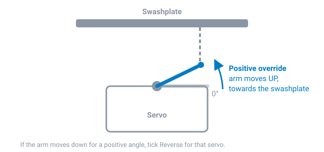

# Servo Setup

Set each servo's pulse range, update rate, centre and direction, so the
mixer can drive the swashplate accurately. Do this before the
[mixer setup](mixer.md). All settings are on the
[Servos](../configurator/tabs/servos.md) tab.

!!! danger "Servos unplugged for step 1"
    A servo driven at the wrong update rate can be damaged within seconds,
    and a narrow-band tail servo driven with a 1520 µs centre slams into its
    end stop. Set the rate and centre **before** plugging the servos in.

## 1. Rate and centre -- servos unplugged

From the servo data sheets:

| | Typical cyclic servo | Typical narrow-band tail servo |
| --- | --- | --- |
| **Center** | 1520 µs | 760 µs |
| **Rate** | 333 Hz | 560 Hz |
| **Min / Max** | -700 / +700 | -350 / +350 |
| **Scale neg / pos** | 500 / 500 | 250 / 250 |

Analogue servos must be set to 50 Hz. Click **Save and Reboot** -- the rate
only changes after a reboot.

Servos on the same timer share a rate. If changing one servo's rate changes
another's, they're on one timer -- see [Remapping](remapping.md).

## 2. Plug in the servos and set directions

1. Connect the servos and power them (battery or BEC -- USB doesn't power
   servos). Swashplate servos go on outputs 1-3 as shown in the diagram on
   the tab; the tail servo on output 4.
2. Fit the servo arms as close to 90° to the servo as the splines allow.
3. **Enable servo override** and move servo 1's slider to a positive angle.
4. The arm must move **up, towards the swashplate**. If it moves down, tick
   **Reverse**.
5. Repeat for servos 2 and 3.

The tail servo's direction is set on the [Mixer](../configurator/tabs/mixer.md)
tab, later.

## 3. Centre the arms

With all overrides at 0°, adjust each servo's **Center** until its arm is
exactly level (90° to the linkage). A quick way: move the override slider
until the arm is level, read the **PWM Signal** value, copy it into
**Center**, then set the override back to 0.

The swashplate will be levelled with the linkages in the
[mixer setup](mixer.md); here, only the servo arms matter.

## 4. Calibrate the throw (recommended)

Servos -- even identical ones -- don't all move exactly the same angle for
the same signal. Calibrating them makes the swashplate move evenly, and is
needed for geometry correction.

1. Set a servo's override to **+30°**.
2. Measure the arm angle (an arm-angle gauge or an app on a phone held
   against the arm).
3. Adjust **Scale pos** until the arm is at exactly 30°.
4. Repeat at **-30°** with **Scale neg**.
5. Repeat for each servo.

If all swashplate servos are calibrated and move in an arc (not linear
servos), turn on **Geo cor** for all of them.

## 5. Travel limits (usually not needed)

With the helicopter assembled, override each servo to about ±80°. If an arm
or ball link hits anything, reduce **Min** or **Max** until it clears.

Rotorflight also limits the blade pitch in the mixer, so with sensible
mixer limits these servo limits rarely come into play.

Turn the servo override off when you're done -- it blocks arming.

Next: [Mixer & Swashplate Setup](mixer.md).
